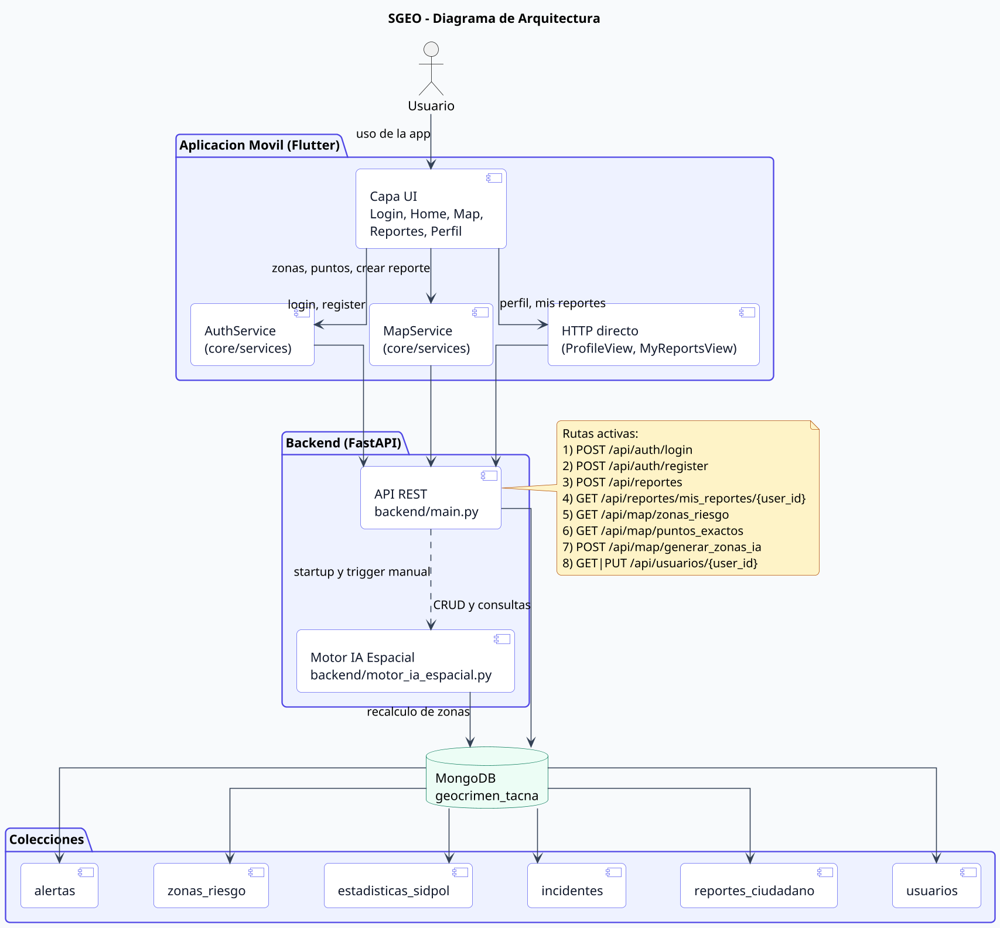
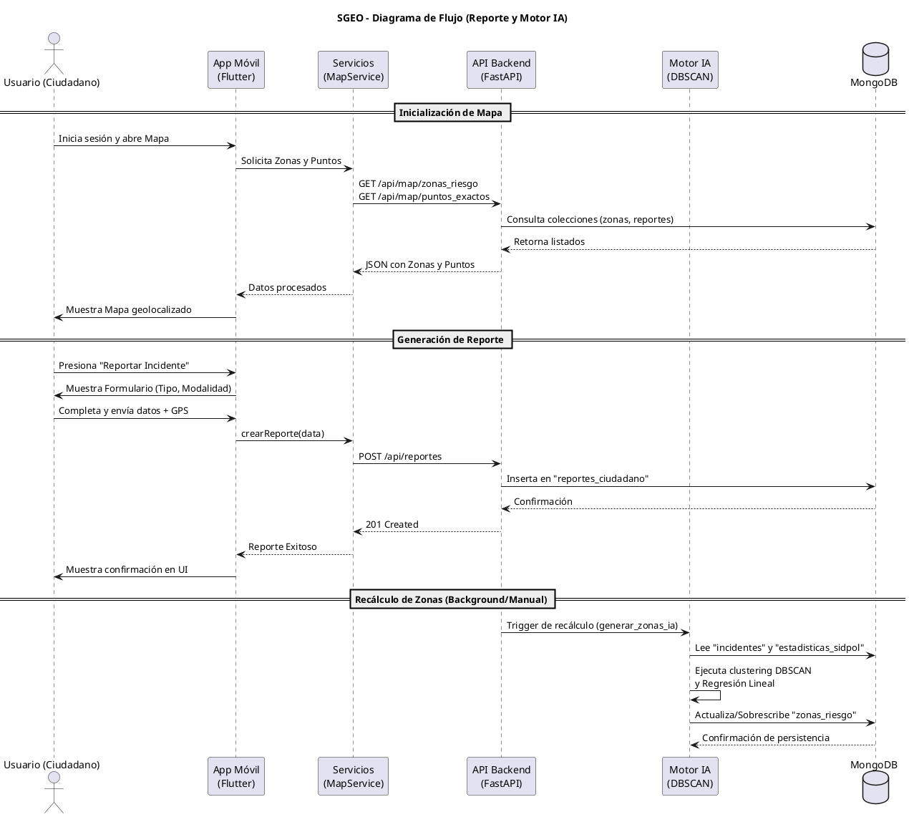
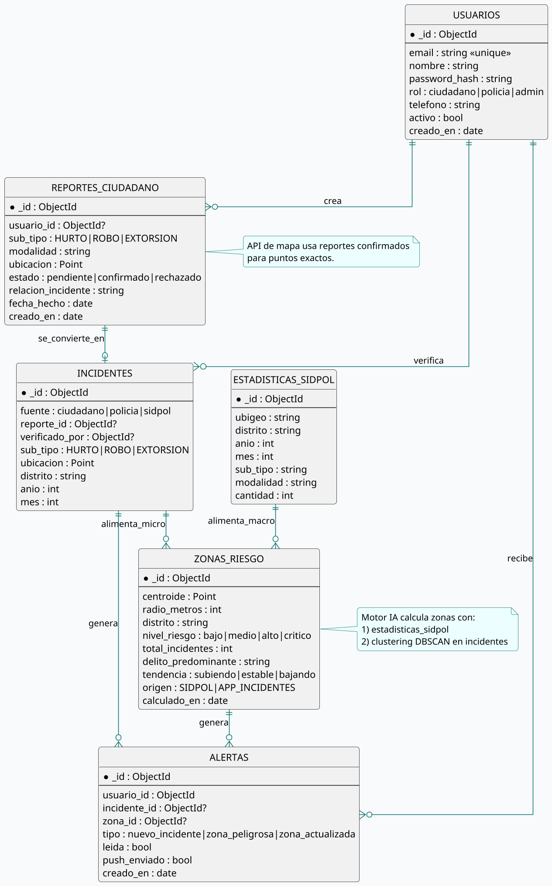
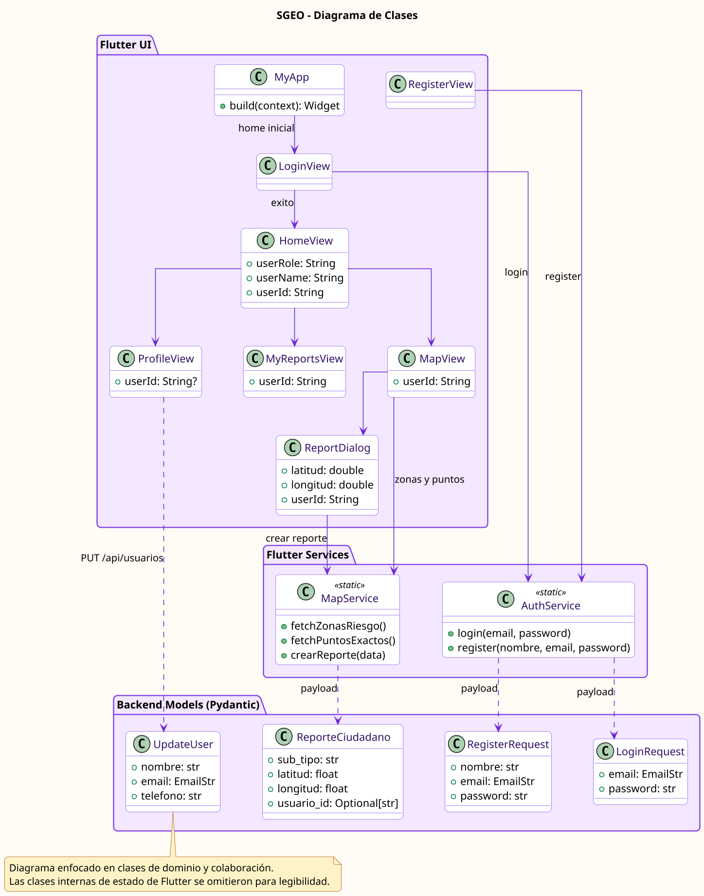

# Diagramas del Proyecto SGEO (Plataforma Táctica)

Este documento consolida los diagramas principales de la plataforma SGEO (Sistema de Geolocalización de Eventos y Operaciones), basándose en la arquitectura, base de datos y flujos del sistema. Estos diagramas proporcionan una visión detallada de cómo interactúan los componentes en la aplicación móvil, el backend de Inteligencia Artificial y la base de datos MongoDB.

---

## 1. Diagrama de Arquitectura

El diagrama de arquitectura define los límites del sistema, mostrando la Aplicación Móvil (Flutter) para la interacción del usuario, el Backend (FastAPI) para el procesamiento de peticiones y ejecución del Motor de IA Espacial, y la Base de Datos (MongoDB) para el almacenamiento de colecciones.

---

## 2. Diagrama de Flujo (Reporte y Visualización)

El diagrama de flujo ilustra el ciclo de vida de un reporte ciudadano, desde la interacción del usuario en la interfaz móvil hasta el procesamiento del motor de IA que recalcula las zonas de riesgo.

---

## 3. Diagrama de Base de Datos (Entidad - Relación)

Este diagrama representa el diseño lógico y relacional sobre nuestra base de datos NoSQL (MongoDB), mostrando la estructura de los documentos y referencias (a través de `ObjectId`) que actúan como llaves foráneas lógicas.

---

## 4. Diagrama de Clases (Aplicación y Dominio)

Muestra las relaciones entre las Vistas (UI), Servicios y los Modelos Pydantic utilizados para el transporte de datos (payloads) hacia la API.

