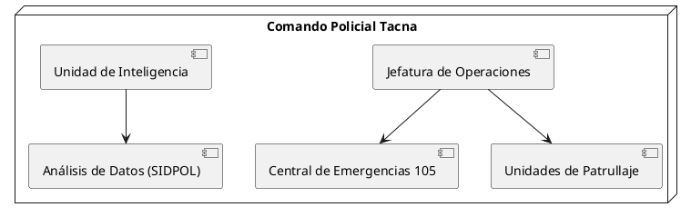
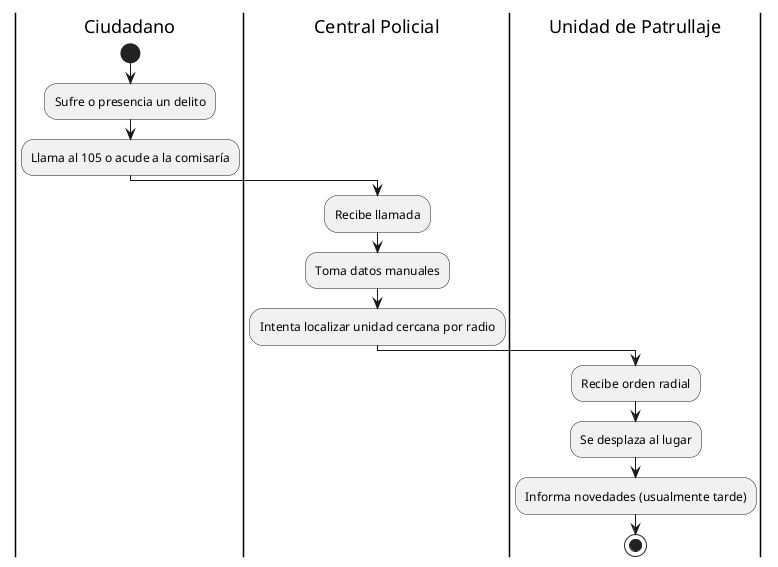
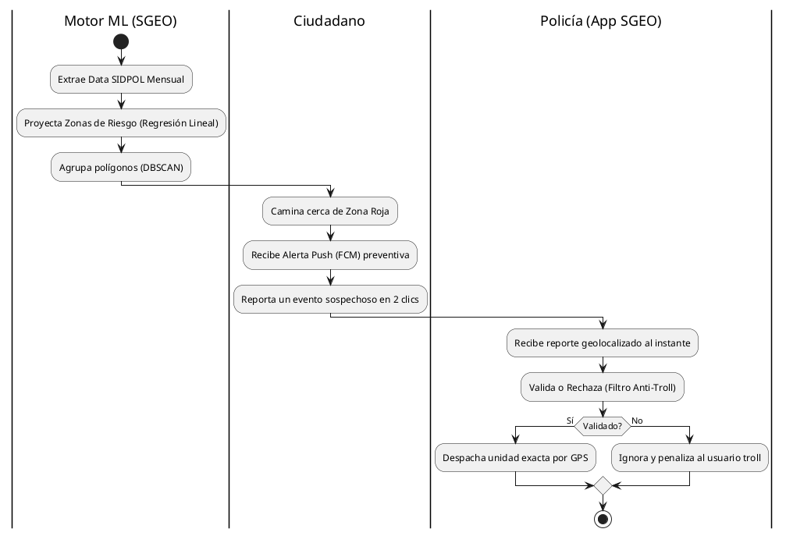
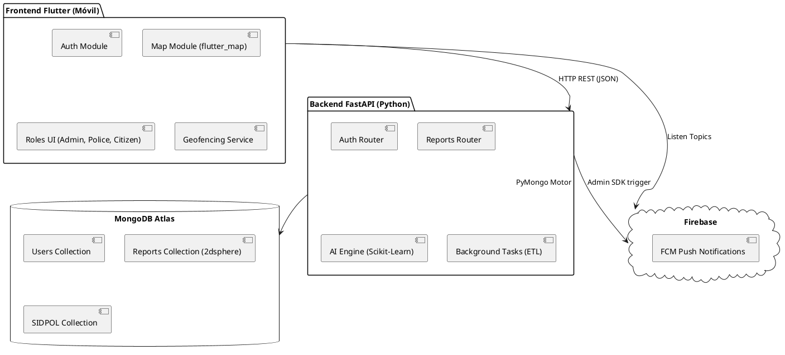
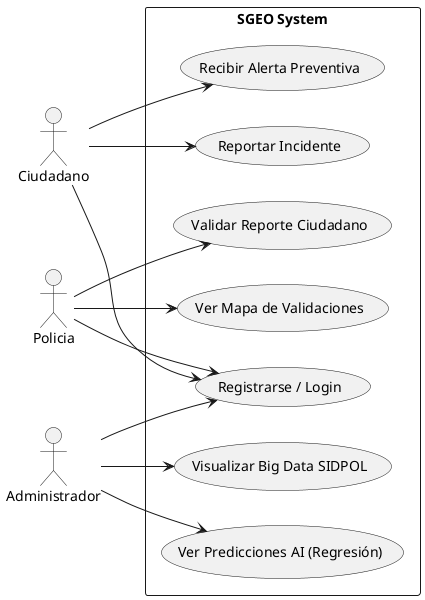
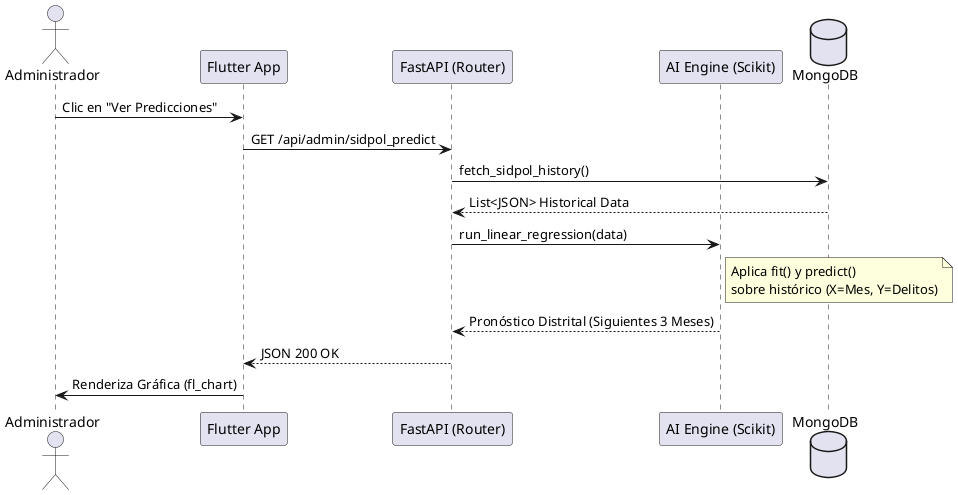
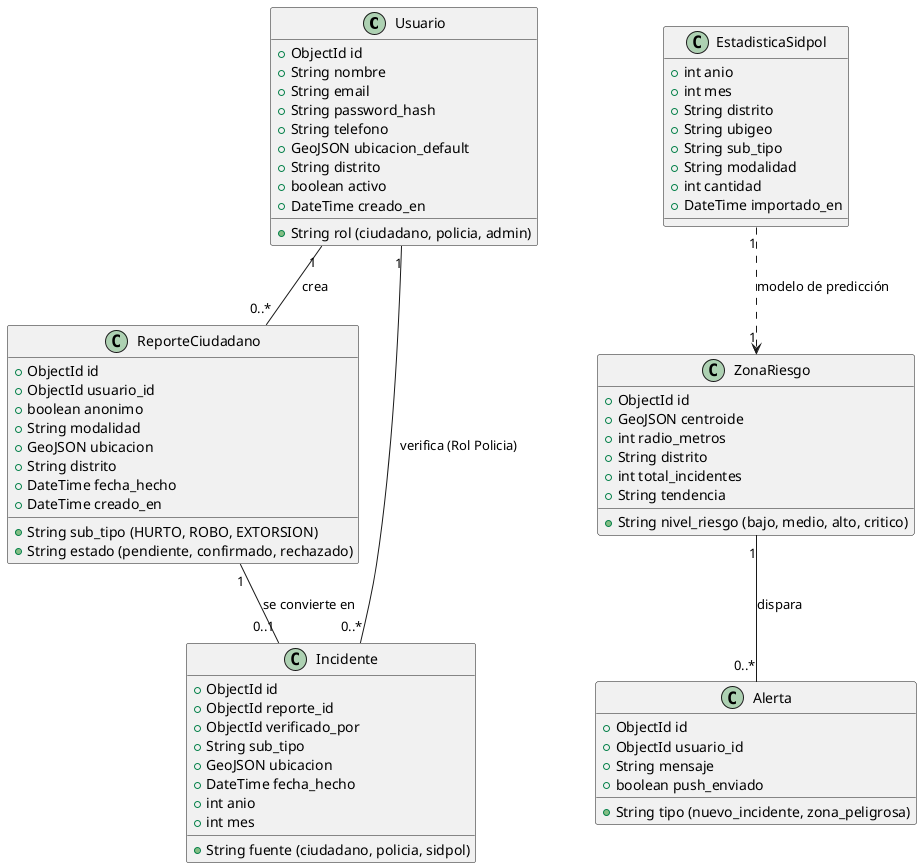

**UNIVERSIDAD PRIVADA DE TACNA**  
**FACULTAD DE INGENIERÍA**  
**Escuela Profesional de Ingeniería de Sistemas**  

**Proyecto: "SGEO — Sistema de Geolocalización de Inseguridad Ciudadana con Machine Learning Predictivo y Espacial"**  

**Curso:** Construcción De Software II  
**Docente:** Alberto Johnatan Flor Rodriguez  

**Integrante:**  
- Piero Alexander Paja de la Cruz (2020067576)  

**Tacna -- Perú**  
**2026**  

---

**Documento de Especificación de Requerimientos de Software (SRS)**  
**Versión:** 1.0  

### CONTROL DE VERSIONES

| Versión | Hecha por | Revisada por | Aprobada por | Fecha      | Motivo                             |
|---------|-----------|--------------|--------------|------------|------------------------------------|
| 1.0     | PP        | PP           | AF           | 13/03/2026 | Creación inicial (Contexto SGEO)   |

---

## ÍNDICE GENERAL

1. [INTRODUCCIÓN](#introducción)
2. [I. Generalidades de la Organización](#i-generalidades-de-la-organización)
3. [II. Visionamiento de la Organización](#ii-visionamiento-de-la-organización)
4. [III. Análisis de Procesos](#iii-análisis-de-procesos)
5. [IV. Especificación de Requerimientos de Software](#iv-especificación-de-requerimientos-de-software)
6. [V. Fase de Desarrollo](#v-fase-de-desarrollo)
   - 5.1 [Perfiles de Usuario](#1-perfiles-de-usuario)
   - 5.2 [Modelo Conceptual (Casos de Uso)](#2-modelo-conceptual)
   - 5.3 [Modelo Lógico (Secuencia y Clases)](#3-modelo-lógico)
7. [CONCLUSIONES](#conclusiones)
8. [RECOMENDACIONES](#recomendaciones)

---

## INTRODUCCIÓN

El presente documento de Especificación de Requerimientos de Software (SRS) describe detalladamente los requerimientos funcionales y no funcionales para el desarrollo del **Sistema de Geolocalización de Inseguridad Ciudadana (SGEO)**, el cual cuenta con motores de Machine Learning predictivo y espacial.

Este proyecto representa una iniciativa tecnológica orientada a reducir el crimen en la ciudad de Tacna al reemplazar los modelos reactivos de patrullaje con analítica predictiva. Integrando reportes ciudadanos con Big Data oficial del Estado Peruano (SIDPOL) mediante una interfaz móvil desarrollada en Flutter y un backend asíncrono en FastAPI.

---

## I. Generalidades de la Organización

**1. Nombre de la Organización Beneficiaria**  
Policía Nacional del Perú (Región Policial Tacna) en coordinación con la Municipalidad Provincial de Tacna.

**2. Visión**  
Garantizar el orden interno, el libre ejercicio de los derechos fundamentales de las personas y el normal desarrollo de las actividades ciudadanas en la región de Tacna, apoyándose en la tecnología de vanguardia y la inteligencia predictiva.

**3. Misión**  
Prestar protección y ayuda a las personas y a la comunidad, investigar los delitos y mantener el orden público, ahora potenciados mediante herramientas de geolocalización cívico-policial.

**4. Organigrama (Contexto del Proyecto)**


---

## II. Visionamiento de la Organización

**1. Descripción del Problema**  
La ciudad de Tacna padece un problema de latencia en la prevención del delito:
- **Tiempos de respuesta lentos:** Patrulleros y serenazgo asisten a lugares donde el crimen ya ocurrió.
- **Data Estadística estancada:** Miles de registros de la Unidad de Flagrancia no se mapean visualmente.
- **Desinformación Ciudadana:** Los civiles caminan por "Zonas Rojas" sin ninguna advertencia, debido a la falta de herramientas de notificación en tiempo real.

**2. Objetivos de Negocios**  
- **Objetivo General:** Desplegar una aplicación móvil que triangule denuncias civiles en vivo y proyecte predicciones criminalísticas para optimizar las rutas de patrullaje.
- **Objetivos Específicos:** 
  - Reducir el tiempo de validación policial de crímenes a menos de 2 minutos.
  - Implementar alertas push automáticas para civiles que crucen áreas de peligro.
  - Ahorrar S/ 16,500 anuales en combustible logístico redirigiendo patrullas bajo algoritmos predictivos (Regresión Lineal).

**3. Objetivos de Diseño**  
- **UI Táctica:** Interfaz "Premium Tactical Dark" en Flutter.
- **Latencia API:** Endpoints en FastAPI resolviendo por debajo de los 300ms.
- **Mapas en caché:** Uso de `flutter_map` para renderizado offline ligero.

**4. Viabilidad del Sistema**  
Técnica y económicamente viable (VAN = S/ 1,501, TIR > 13%). Uso de tecnologías Open Source (Python, Dart/Flutter, MongoDB Atlas Tier gratuito inicial).

---

## III. Análisis de Procesos

### a) Diagrama del Proceso Actual (Reactivo)


### b) Diagrama del Proceso Propuesto (SGEO Predictivo y Preventivo)


---

## IV. Especificación de Requerimientos de Software

### a) Cuadro de Requerimientos Funcionales

| ID | Módulo | Requerimiento Funcional | Descripción Detallada | Actor | Prioridad |
|----|--------|-------------------------|-----------------------|-------|-----------|
| **RF001** | Autenticación | Control de Accesos | El sistema debe permitir el registro y autenticación de usuarios bajo tres roles: Ciudadano, Policía y Administrador. | Múltiple | Crítica |
| **RF002** | Interfaz | Redirección por Roles | El sistema debe redirigir a cada usuario a un Dashboard diferente dependiendo de su rol (RBAC). | Múltiple | Alta |
| **RF003** | Geolocalización | Reporte de Incidentes | Los Ciudadanos deben poder colocar marcadores de crimen en el mapa interactivo con latitud y longitud precisa. | Ciudadano | Crítica |
| **RF004** | Validación | Filtro de Reportes | El Policía debe poder visualizar los reportes pendientes en un radio de 3 km y presionar "Validar" o "Rechazar". | Policía | Crítica |
| **RF005** | Inteligencia Artificial | Algoritmo DBSCAN | El Backend (FastAPI) debe ejecutar el algoritmo espacial DBSCAN sobre los reportes validados para generar Zonas de Riesgo. | Sistema | Alta |
| **RF006** | Notificaciones | Alertas Preventivas | La app móvil debe ejecutar un servicio en background (Geofencing) para enviar Push si el usuario entra a una Zona Roja. | Ciudadano | Alta |
| **RF007** | Analítica | Visualización Gráfica | El Administrador debe poder ver estadísticas de crímenes en gráficos dinámicos (fl_chart) filtrados por tiempo. | Administrador | Media |
| **RF008** | Integración | Automatización ETL | El sistema debe contar con un cron job ETL para hacer scraping e importar datos históricos del SIDPOL a MongoDB. | Sistema | Media |
| **RF009** | Machine Learning | Predicción Temporal | El Backend debe exponer un modelo de Regresión Lineal sobre la data de SIDPOL para pronosticar delitos por distrito mensual. | Administrador | Media |

### b) Cuadro de Requerimientos No Funcionales

| ID | Módulo | Requerimiento No Funcional | Descripción Detallada | Categoría |
|----|--------|----------------------------|-----------------------|-----------|
| **RNF001** | Arquitectura | Multiplataforma Híbrida | El sistema debe estar desarrollado en Flutter (Dart) para asegurar exportación simultánea e idéntica a iOS y Android. | Rendimiento |
| **RNF002** | Base de Datos | Persistencia Geoespacial | La base de datos debe ser MongoDB Atlas utilizando índices `2dsphere` para cálculos geográficos en milisegundos. | Escalabilidad |
| **RNF003** | Seguridad | Encriptación Criptográfica | Todas las contraseñas de los usuarios deben encriptarse obligatoriamente usando el algoritmo Bcrypt con salt. | Seguridad |
| **RNF004** | UI/UX | Estética Premium | La interfaz debe adherirse estrictamente al sistema "Premium Tactical Dark" (Fondos #1A1A24, Acentos #E53935). | Diseño |
| **RNF005** | Rendimiento | Latencia Mínima HTTP | El tiempo de respuesta de los endpoints del mapa en FastAPI no debe superar los 300 milisegundos con red 4G. | Performance |

### c) Reglas de Negocio

- **RN01 - Bloqueo por Spam:** Si un Ciudadano recibe 3 reportes marcados como "Rechazados" por un Policía, su cuenta es baneada para crear reportes por 72 horas.
- **RN02 - Vigencia de Reportes:** Todo reporte ciudadano validado por la policía formará parte de la Zona de Riesgo solo por 48 horas. Luego decaerá estadísticamente si no hay nuevos eventos cercanos (Decaimiento Temporal).
- **RN03 - Autoridad Policial:** Un Policía solo puede validar incidentes que ocurran dentro de un radio de 3 kilómetros desde su posición GPS actual (asegurando el conocimiento in-situ de su cuadrante).

---

## V. Fase de Desarrollo

### 1. Perfiles de Usuario

| Perfil | Rol en SGEO | Nivel de Acceso | Funciones Principales |
|--------|-------------|-----------------|-----------------------|
| **Ciudadano** | Consumidor/Generador | Básico | Reportar eventos, ver mapa térmico civil, recibir alertas Push de prevención. |
| **Policía** | Auditor de Campo | Intermedio | Auditar reportes ciudadanos, confirmar emergencias, gestionar su cuadrante de 3km. |
| **Administrador** | Oficial de Inteligencia | Avanzado | Visualizar Big Data del SIDPOL, analizar predicciones de Machine Learning, suspender usuarios, ver métricas policiales. |

---

### 2. Modelo Conceptual

#### a) Diagrama de Paquetes (Arquitectura General SGEO)


#### b) Diagrama de Casos de Uso (General)


#### c) Escenarios de Caso de Uso

**Caso de Uso:** Reportar Incidente (UC2)
- **Actor:** Ciudadano
- **Precondiciones:** El usuario tiene sesión iniciada y el GPS encendido.
- **Flujo Principal:** 
  1. El ciudadano presiona el botón rojo "Reportar".
  2. El sistema captura la latitud y longitud actuales.
  3. El usuario selecciona el tipo de evento (Robo, Sospecha, Vandalismo).
  4. El sistema envía el payload JSON a FastAPI.
  5. La base de datos guarda el reporte en estado `pending`.
- **Postcondiciones:** El reporte aparece instantáneamente en la pantalla de los Policías en un radio de 3km.

**Caso de Uso:** Ver Predicciones AI (UC6)
- **Actor:** Administrador
- **Precondiciones:** Autenticado con rol `admin`. La base de datos SIDPOL tiene al menos 1,000 registros históricos.
- **Flujo Principal:**
  1. El Administrador navega a la pestaña "Predicción Táctica".
  2. El sistema envía una solicitud GET `/api/admin/sidpol_predict`.
  3. El backend carga el dataset en Pandas, entrena un modelo de Regresión Lineal y estima los incidentes para el siguiente trimestre.
  4. La aplicación Flutter dibuja el gráfico usando `fl_chart`.

---

### 3. Modelo Lógico

#### a) Diagrama de Actividades (Algoritmo de Validación)
```plantuml
@startuml
start
:Ciudadano emite Reporte;
:Guardar en MongoDB (Estado = Pendiente);
:Notificar Policías en radio de 3KM;
|App Policía|
:Mostrar notificación local;
:Policía visualiza reporte en mapa;
if (Es verídico?) then (Sí)
  :Policía presiona Validar;
  |Backend FastAPI|
  :Actualizar estado a "Confirmado";
  :Ejecutar algoritmo DBSCAN;
  if (Genera nuevo cluster rojo?) then (Sí)
    :Disparar Push Notification a ciudadanos cercanos;
  else (No)
  endif
else (No)
  |App Policía|
  :Policía presiona Rechazar;
  |Backend FastAPI|
  :Anotar strike en cuenta ciudadana;
endif
stop
@enduml
```

#### b) Diagrama de Secuencia (Predicción Machine Learning)


#### c) Diagrama de Clases (Arquitectura de Base de Datos y Modelos)


---

## CONCLUSIONES
La especificación de requerimientos del sistema SGEO demuestra una planeación arquitectónica sólida que cubre desde la interacción móvil de alto nivel hasta la infraestructura predictiva en la nube. Los diagramas UML evidencian flujos de trabajo claros donde la Inteligencia Artificial (DBSCAN y Regresión Lineal) no es un añadido estético, sino el núcleo del sistema de prevención, procesando la carga de reportes validados y la vasta información del Estado Peruano. 

Este SRS garantiza que el equipo de desarrollo tiene las directrices exactas para implementar un código modularizado, seguro (RBAC y Bcrypt), y altamente performante (Flutter y FastAPI).

## RECOMENDACIONES
- Se recomienda realizar pruebas de carga (`stress testing`) sobre la API en FastAPI para simular escenarios de pánico masivo donde miles de ciudadanos intenten abrir el mapa al mismo tiempo.
- Afinar los hiperparámetros del algoritmo DBSCAN (especialmente el valor *Epsilon* correspondiente a la cercanía en metros) a través de ensayos de campo reales en la ciudad de Tacna para evitar falsas geocercas rojas. 
- Mantener los Cron Jobs del ETL de SIDPOL aislados del proceso principal del servidor para asegurar que la descarga pesada de datos gubernamentales no interrumpa las respuestas del API móvil.
