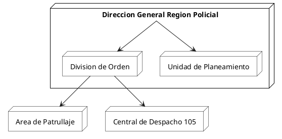
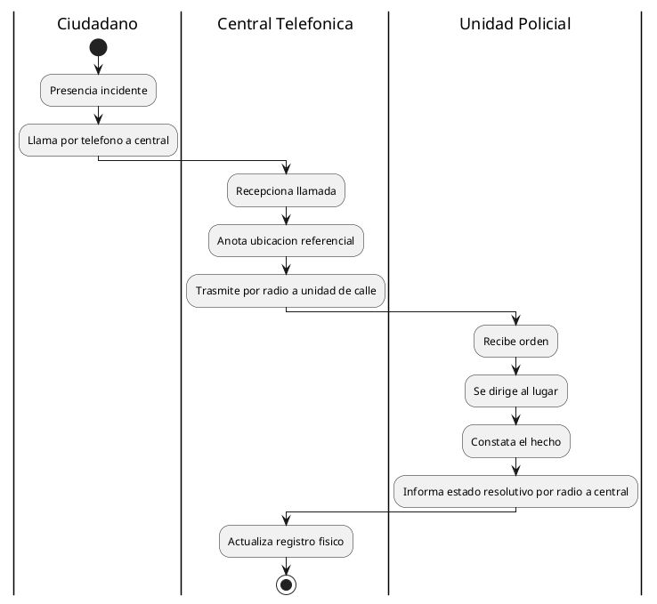
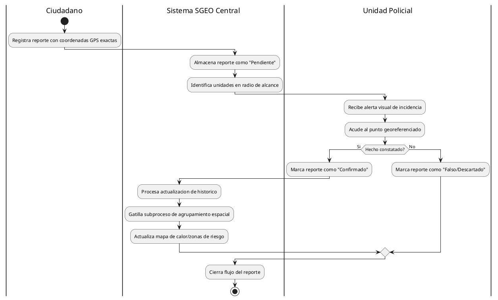
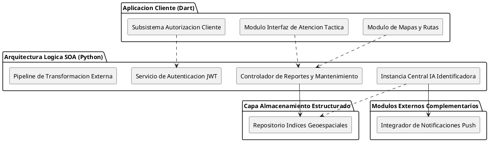
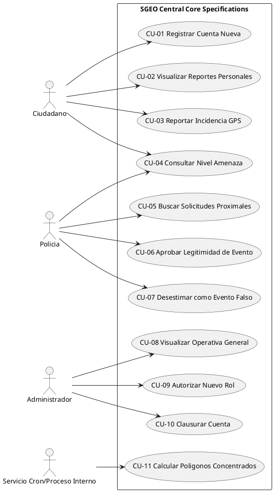
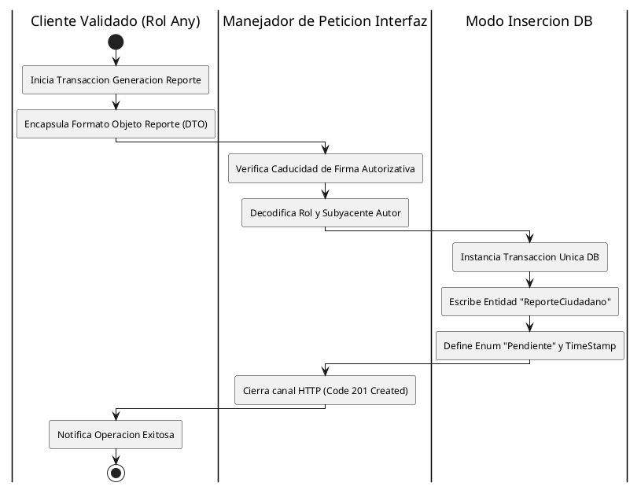
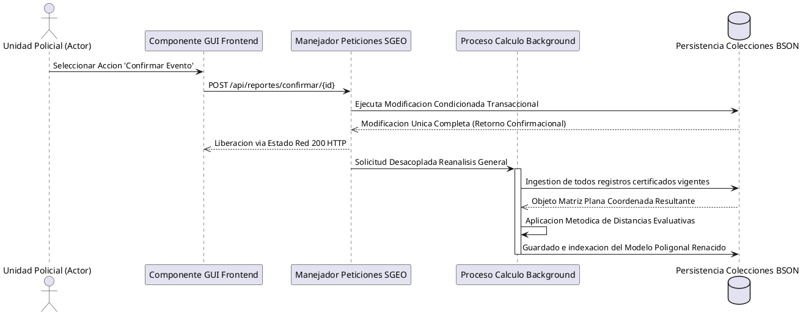
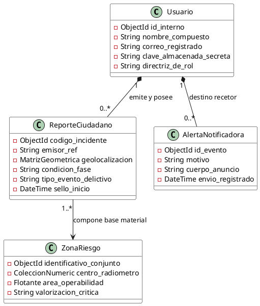

**UNIVERSIDAD PRIVADA DE TACNA**  
**FACULTAD DE INGENIERIA**  
**Escuela Profesional de Ingenieria de Sistemas**  

**Proyecto: "SGEO - Sistema de Geolocalizacion de Inseguridad Ciudadana con Analisis Predictivo y Espacial"**  

**Curso:** Construccion De Software II  
**Docente:** Alberto Johnatan Flor Rodriguez  

**Integrante:**  
- Piero Alexander Paja de la Cruz (2020067576)  

**Tacna -- Peru**  
**2026**  

---

**Documento de Especificacion de Requerimientos de Software (SRS)**  
**Version:** 4.0 (Alineacion Integral estandar IEEE 830 / ISO 29148)

---

# INDICE DE CONTENIDOS

1. [INTRODUCCION](#introduccion)
2. [I. Generalidades de la Empresa](#i-generalidades-de-la-empresa)
   - 1. [Nombre de la Empresa](#1-nombre-de-la-empresa)
   - 2. [Vision](#2-vision)
   - 3. [Mision](#3-mision)
   - 4. [Organigrama](#4-organigrama)
3. [II. Visionamiento de la Empresa](#ii-visionamiento-de-la-empresa)
   - 1. [Descripcion del Problema](#1-descripcion-del-problema)
   - 2. [Objetivos de Negocios](#2-objetivos-de-negocios)
   - 3. [Objetivos de Disenio](#3-objetivos-de-disenio)
   - 4. [Alcance del Proyecto](#4-alcance-del-proyecto)
   - 5. [Viabilidad del Sistema](#5-viabilidad-del-sistema)
   - 6. [Informacion Obtenida del Levantamiento de Informacion](#6-informacion-obtenida-del-levantamiento-de-informacion)
4. [III. Analisis de Procesos](#iii-analisis-de-procesos)
   - a) [Diagrama del Proceso Actual (Diagrama de Actividades)](#a-diagrama-del-proceso-actual-diagrama-de-actividades)
   - b) [Diagrama del Proceso Propuesto (Diagrama de Actividades Inicial)](#b-diagrama-del-proceso-propuesto-diagrama-de-actividades-inicial)
5. [IV. Especificacion de Requerimientos de Software](#iv-especificacion-de-requerimientos-de-software)
   - a) [Cuadro de Requerimientos Funcionales Inicial](#a-cuadro-de-requerimientos-funcionales-inicial)
   - b) [Cuadro de Requerimientos No Funcionales](#b-cuadro-de-requerimientos-no-funcionales)
   - c) [Cuadro de Requerimientos Funcionales Final](#c-cuadro-de-requerimientos-funcionales-final)
   - d) [Reglas de Negocio](#d-reglas-de-negocio)
6. [V. Fase de Desarrollo](#v-fase-de-desarrollo)
   - 1. [Perfiles de Usuario](#1-perfiles-de-usuario)
   - 2. [Modelo Conceptual](#2-modelo-conceptual)
      - a) [Diagrama de Paquetes](#a-diagrama-de-paquetes)
      - b) [Diagrama de Casos de Uso](#b-diagrama-de-casos-de-uso)
      - c) [Escenarios de Caso de Uso (Narrativa)](#c-escenarios-de-caso-de-uso-narrativa)
   - 3. [Modelo Logico](#3-modelo-logico)
      - a) [Analisis de Objetos](#a-analisis-de-objetos)
      - b) [Diagrama de Actividades con Objetos](#b-diagrama-de-actividades-con-objetos)
      - c) [Diagrama de Secuencia](#c-diagrama-de-secuencia)
      - d) [Diagrama de Clases](#d-diagrama-de-clases)
7. [CONCLUSIONES](#conclusiones)
8. [RECOMENDACIONES](#recomendaciones)
9. [BIBLIOGRAFIA](#bibliografia)
10. [WEBGRAFIA](#webgrafia)

---

## INTRODUCCION

El presente Documento de Especificacion de Requerimientos de Software (SRS) tiene como proposito definir de manera formal, inequivoca y verificable las funcionalidades y restricciones del Sistema de Geolocalizacion de Inseguridad Ciudadana (SGEO). Este documento actua como el contrato base de ingenieria que rige el comportamiento del sistema, detallando que debe hacer la plataforma sin especificar los detalles de su implementacion subyacente. Esta redactado siguiendo las directrices fundamentales establecidas en los estandares de ingenieria de software formales, garantizando trazabilidad y claridad para analistas, desarrolladores y validadores de calidad (QA).

---

## I. Generalidades de la Empresa

### 1. Nombre de la Empresa
Policia Nacional del Peru (Region Policial Tacna), en operacion conjunta con las municipalidades distritales y la red ciudadana.

### 2. Vision
Ser la institucion publica lider a nivel nacional en la aplicacion de tecnologias geoespaciales para la prevencion del delito, estandarizando protocolos de respuesta policial basados en inteligencia de datos para el anio 2030.

### 3. Mision
Administrar, validar y procesar la informacion de incidencias delictivas reportadas por la ciudadania y el personal policial, con el fin de generar mapas de riesgo actualizados que permitan optimizar la asignacion de recursos de patrullaje preventivo.

### 4. Organigrama

```plantuml
@startuml
skinparam shadowing false
skinparam roundcorner 5
skinparam defaultFontName Arial
skinparam node {
    BackgroundColor white
    BorderColor black
}

node "Direccion General Region Policial" as DGRP {
  node "Unidad de Planeamiento" as UP
  node "Division de Orden" as DO
}

node "Area de Patrullaje" as AP
node "Central de Despacho 105" as C105

DGRP --> UP
DGRP --> DO
DO --> AP
DO --> C105
@enduml
```

---

## II. Visionamiento de la Empresa

### 1. Descripcion del Problema
La gestion actual de emergencias e incidencias delictivas se basa en procesos reactivos con baja integracion tecnologica comunitaria. Los ciudadanos carecen de un canal de comunicacion geografica directa con las unidades de patrullaje sectorial. Asimismo, la administracion operativa carece de sistemas automaticos que identifiquen concentraciones delictivas, dependiendo de analisis manuales lentos que retrasan la advertencia a los civiles que transitan por areas de alto riesgo.

### 2. Objetivos de Negocios
- Disminuir el tiempo de recoleccion y validacion de datos sobre incidentes delictivos en un 40%.
- Aumentar la precision en la identificacion de sectores peligrosos mediante validacion de reportes cruzados.
- Establecer un canal oficial de comunicacion asincrona para prevencion comunitaria.

### 3. Objetivos de Disenio
- Diseniar una arquitectura unificada que permita acceso desde terminales moviles y paneles web administrativos.
- Garantizar tiempos de respuesta optimos frente a consultas estructuradas de geolocalizacion.
- Establecer controles de acceso basados en roles (RBAC) para segregar la visualizacion y mutacion de datos sensibles.

### 4. Alcance del Proyecto
Este SRS contempla el dominio del sistema SGEO, abarcando:
- Modulo de autenticacion y gestion de perfiles (Ciudadanos, Policias, Administradores).
- Modulo de emision, recepcion y clasificacion de reportes geolocalizados.
- Modulo de analisis espacial y generacion de poligonos de precaucion.
- Modulo de notificaciones y emision de alertas georreferenciadas.
- Modulo administrativo de metricas e importacion de datos externos.

### 5. Viabilidad del Sistema
El desarrollo es tecnica y operativamente viable. La solucion emplea estandares abiertos y estandares HTTP probados que permiten escalar de forma horizontal y aseguran compatibilidad con la infraestructura de red movil empleada por la institucion policial.

### 6. Informacion Obtenida del Levantamiento de Informacion
Mediante entrevistas con operadores del sistema de despacho, se concluyo que los reportes aislados no deben ser tomados como verdades absolutas por el sistema hasta recibir confirmacion oficial, a fin de evitar alarmas falsas generalizadas.

---

## III. Analisis de Procesos

### a) Diagrama del Proceso Actual (Diagrama de Actividades)

```plantuml
@startuml
|Ciudadano|
start
:Presencia incidente;
:Llama por telefono a central;
|Central Telefonica|
:Recepciona llamada;
:Anota ubicacion referencial;
:Trasmite por radio a unidad de calle;
|Unidad Policial|
:Recibe orden;
:Se dirige al lugar;
:Constata el hecho;
:Informa estado resolutivo por radio a central;
|Central Telefonica|
:Actualiza registro fisico;
stop
@enduml
```

### b) Diagrama del Proceso Propuesto (Diagrama de Actividades Inicial)

```plantuml
@startuml
|Ciudadano|
start
:Registra reporte con coordenadas GPS exactas;
|Sistema SGEO Central|
:Almacena reporte como "Pendiente";
:Identifica unidades en radio de alcance;
|Unidad Policial|
:Recibe alerta visual de incidencia;
:Acude al punto georeferenciado;
if (Hecho constatado?) then (Si)
  :Marca reporte como "Confirmado";
  |Sistema SGEO Central|
  :Procesa actualizacion de historico;
  :Gatilla subproceso de agrupamiento espacial;
  :Actualiza mapa de calor/zonas de riesgo;
else (No)
  |Unidad Policial|
  :Marca reporte como "Falso/Descartado";
endif
|Sistema SGEO Central|
:Cierra flujo del reporte;
stop
@enduml
```

---

## IV. Especificacion de Requerimientos de Software

### a) Cuadro de Requerimientos Funcionales Inicial
Se omitio en favor de presentar un inventario de requerimientos funcionales integral, unificado y exhaustivo en la seccion IV.c.

---

### b) Cuadro de Requerimientos No Funcionales

**Categoria: Seguridad (SEC)**
- **RNF-SEC-01 (Autenticacion Segura):** El sistema debe utilizar mecanismos de cifrado unidireccional con sal (salting) para el almacenamiento de contrasenias.
- **RNF-SEC-02 (Transito de Datos):** Toda comunicacion cliente-servidor debe estar encriptada obligatoriamente bajo protocolo TLS 1.2 o superior (HTTPS).
- **RNF-SEC-03 (Sesiones):** *(planificado — depende de la adopcion de JWT del roadmap)* Las sesiones moviles deben expirar automaticamente o caducar los tokens de acceso tras 24 horas de inactividad sin renovacion. En la version actual la sesion persiste en el cliente (SharedPreferences) hasta el cierre de sesion manual.

**Categoria: Rendimiento (PER)**
- **RNF-PER-01 (Consultas Espaciales):** El sistema debe resolver las consultas de proximidad geografica (busqueda de reportes cercanos) en un tiempo menor a 500 milisegundos bajo una carga concurrente nominal de 100 usuarios.
- **RNF-PER-02 (Latencia de Notificaciones):** El retardo maximo aceptable entre el despacho de una notificacion y el envio a la plataforma externa de mensajeria debe ser estrictamente menor a 2 segundos.

**Categoria: Confiabilidad y Disponibilidad (REL)**
- **RNF-REL-01 (Tolerancia a Fallos):** El sistema debe ser capaz de reintentar la persistencia de datos en caso de una perdida temporal de conexion con el servicio de base de datos.
- **RNF-REL-02 (Disponibilidad Operativa):** El entorno principal del servidor de aplicaciones debe mantener un nivel de disponibilidad (Uptime) contractual del 99.9% anual.

**Categoria: Usabilidad (USA)**
- **RNF-USA-01 (Adaptabilidad Movil):** La interfaz grafica principal de la aplicacion debe adaptar sus menus de interaccion y proporciones cartograficas en resoluciones que oscilen desde los 360px hasta los 1200px de ancho logico sin distorsion.
- **RNF-USA-02 (Feedback de Red):** El sistema debe mostrar indicadores de carga visibles siempre que una transaccion de red exceda los 500 milisegundos en resolverse.

**Categoria: Portabilidad y Compatibilidad (POR)**
- **RNF-POR-01 (Sistemas Operativos):** La version empaquetada principal del lado cliente debe poder instalarse en dispositivos con sistema operativo Android version 8.0 (API 26) o superior.

---

### c) Cuadro de Requerimientos Funcionales Final

A continuacion se detallan exhaustivamente los Requerimientos Funcionales (RF), categorizados por modulo operativo.

#### Modulo 1: Autenticacion y Gestion de Identidad

- **RF-AUT-01: Registro de Usuarios**
  - **Descripcion formal:** El sistema debe permitir a un usuario no registrado crear una cuenta ingresando su nombre completo, correo electronico, contrasenia y rol solicitado. Tanto el correo como el nombre deben ser unicos en el sistema (HTTP 400 si ya existen). Si el rol solicitado es "policia", la cuenta se crea desactivada con marca `aprobacion_pendiente` y se envia un correo solicitando los datos de acreditacion (CIP), quedando a la espera de la aprobacion del Administrador.
  - **Actor:** Usuario Anonimo
  - **Precondiciones:** El usuario no debe poseer sesion activa; el email y el nombre no deben existir en el registro.
  - **Identificador de Endpoint:** POST /api/auth/register

- **RF-AUT-02: Inicio de Sesion**
  - **Descripcion formal:** El sistema debe autenticar las credenciales contra el hash bcrypt almacenado y devolver los datos del perfil (id, nombre, email, rol) que el cliente persiste en `SharedPreferences` para el enrutamiento por rol. Las respuestas de error usan un mensaje generico unico ("Correo o contrasenia incorrectos") para no revelar si el correo existe. Cuentas policiales pendientes de aprobacion o rechazadas reciben HTTP 403 con el motivo.
  - **Actor:** Todos los Roles.
  - **Entradas:** Credenciales de usuario. **Salidas:** Perfil del usuario y rol para enrutamiento.
  - **Identificador de Endpoint:** POST /api/auth/login

- **RF-AUT-03: Cierre de Sesion Seguro**
  - **Descripcion formal:** El sistema debe permitir la revocacion del token activo y purgar los datos de sesion local del cliente.

- **RF-AUT-04: Recuperacion de Acceso** *(diferido a roadmap)*
  - **Descripcion formal:** El sistema debe emitir un mecanismo (enlace o codigo por correo electronico) para restaurar credenciales de cuentas ciudadanas perdidas. La infraestructura de correo transaccional (servicio Resend en `email_service.py`) ya esta operativa para el flujo de acreditacion policial; el flujo de recuperacion se encuentra planificado para la siguiente iteracion.

- **RF-AUT-05: Modificacion de Perfil Propio**
  - **Descripcion formal:** El sistema debe permitir actualizar nombre o numero de contacto del perfil, restringiendo cambios en campos inmutables como el correo root.

#### Modulo 2: Gestion de Reportes Geoespaciales

- **RF-REP-01: Creacion de Alerta de Incidente**
  - **Descripcion formal:** El sistema debe proveer de un formulario que capture coordenadas geograficas (Latitud/Longitud), nivel de criticidad o tipo de delito y una descripcion opcional.
  - **Actor:** Ciudadano / Policia
  - **Restricciones:** Un usuario registrado no podra emitir mas de 5 reportes por dia calendario; el sexto intento recibe HTTP 429 (Regla Antispam, validada por prueba automatizada). Los subtipos admitidos son HURTO y ROBO.
  - **Identificador de Endpoint:** POST /api/reportes

- **RF-REP-02: Visualizacion de Detalle de Reporte**
  - **Descripcion formal:** El sistema debe arrojar todos los atributos descriptivos, temporalidad y estatus resolutivo de un incidente previamente emitido.

- **RF-REP-03: Cancelacion de Reportes Propios**
  - **Descripcion formal:** El sistema debe posibilitar la anulacion definitiva de los reportes unicamente si el actor instanciado es el creador legitimo y el estado del reporte recae en "Pendiente".

- **RF-REP-04: Consulta Historica Personal**
  - **Descripcion formal:** El sistema debe exponer un listado en formato descendente temporal con la traza de reportes elaborados por el usuario autenticado.

#### Modulo 3: Interacciones Tacticas de Unidades Oficiales

- **RF-TAC-01: Listado de Reportes Cercanos**
  - **Descripcion formal:** El sistema debe proveer al Rol Policial la totalidad de reportes ciudadanos (pendientes, confirmados y rechazados) para su pestania de Validacion e historial, y su mapa tactico debe resaltar visualmente el radio de patrullaje de 1 km alrededor de la posicion del efectivo mediante un efecto sonar animado, con contador de reportes pendientes dentro de la zona. La lista y el mapa se refrescan automaticamente cada 30 segundos para captar reportes emitidos desde otros dispositivos.
  - **Actor:** Policia
  - **Precondiciones:** Permisos validos de Rol Policial y hardware GPS funcional.
  - **Identificador de Endpoint:** GET /api/reportes/policia

- **RF-TAC-02: Confirmacion Oficial de Incidencia**
  - **Descripcion formal:** El sistema debe otorgar potestad al Rol Policial de alterar permanentemente el estado transaccional de un reporte de "Pendiente" a "Confirmado". La confirmacion desencadena en cascada: (1) copia del incidente al historial estandarizado `historial_delitos` con `fuente="ciudadano"`, (2) agrupacion automatica de reportes pendientes del mismo subtipo en un radio de 500 m, (3) notificacion push masiva con las coordenadas GPS exactas, y (4) recalculo del motor DBSCAN en segundo plano. Si la copia al historial falla, la confirmacion se aborta integralmente (atomicidad).
  - **Salidas:** Modificacion exitosa del estado del registro y efectos en cascada.
  - **Identificador de Endpoint:** POST /api/reportes/confirmar/{id}

- **RF-TAC-03: Rechazo de Falsas Alarmas**
  - **Descripcion formal:** El sistema debe permitir transicionar alertas infundadas al estado "Descartado", aislando dicha data de modulos futuros de evaluacion estadistica.

#### Modulo 4: Panel Administrativo Integrado

- **RF-ADM-01: Listado Global de Usuarios**
  - **Descripcion formal:** El sistema debe renderizar de manera seccionada o paginada el inventario de cuentas inscritas en el sistema.
  - **Actor:** Administrador
  - **Identificador de Endpoint:** GET /api/admin/usuarios

- **RF-ADM-02: Aprobacion de Cuentas Policiales**
  - **Descripcion formal:** El sistema debe exponer al Administrador una vista de aprobaciones con las cuentas policiales pendientes (`aprobacion_pendiente`), permitiendo aprobarlas (activando la cuenta) o rechazarlas registrando un motivo que sera comunicado al solicitante en su siguiente intento de inicio de sesion.

- **RF-ADM-03: Suspension de Cuentas Ciudadanas**
  - **Descripcion formal:** El sistema debe habilitar el bloqueo transaccional temporal o indefinido sobre cuentas infractoras reiteradas.

- **RF-ADM-04: Exportacion y Dashboard Analitico**
  - **Descripcion formal:** El sistema debe generar sumarios temporales aglutinando conteos y porcentajes resolutivos para visualizar estadisticas maestras operacionales.

- **RF-ADM-05: Inyeccion Estructurada de Datos (ETL Manual)**
  - **Descripcion formal:** El sistema debera suministrar una entrada para instruir la lectura asimilacion masiva de ficheros de reportes delictivos gubernamentales offline hacia la base del sistema central.

#### Modulo 5: Mapas Cartograficos e Inteligencia Espacial

- **RF-MAP-01: Visualizar Capas de Superficie Cartografica**
  - **Descripcion formal:** El cliente presentara una superficie de mapa iterativa renderizada dinamicamente a partir de un servicio externo.

- **RF-MAP-02: Extraccion de Zonas de Riesgo Agrupadas**
  - **Descripcion formal:** El sistema entregara colecciones procesadas de geometrias o centroides que representen las acumulaciones delictivas (Zonas Rojas) validadas matematicamente.
  - **Actor:** Todos
  - **Identificador de Endpoint:** GET /api/map/zonas_riesgo

- **RF-MAP-03: Calculo de Indice de Riesgo Dinamico (Safety Score)**
  - **Descripcion formal:** El sistema debera procesar las coordenadas enviadas por el cliente cruzandolas frente a zonas DBSCAN, densidad de incidentes en radio 1km, factor del turno horario actual y la tendencia del distrito mas cercano, para generar un escalar representativo del peligro actual en escala 0-100.
  - **Identificador de Endpoint:** GET /api/predictive/safety_score

- **RF-MAP-04: Consulta de Tramos Temporales Sugeridos (Safe Hours)**
  - **Descripcion formal:** El sistema permitira consultar estimaciones sobre periodos de baja ocurrencia delictiva mediante analisis estadistico por hora, turno y dia de la semana, retornando franjas horarias seguras y de riesgo con recomendacion textual.
  - **Identificador de Endpoint:** GET /api/predictive/safe_hours

- **RF-MAP-05: Actualizacion Interna del Arbol de Riesgo (Sistema)**
  - **Descripcion formal:** El sistema debe gatillar autonomicamente calculos de identificacion de hotspots mediante DBSCAN cada vez que el subsistema recaude un reporte confirmado, ejecutandose en segundo plano via BackgroundTasks sin bloquear el Event Loop. El motor detecta automaticamente el mes mas reciente con datos SIDPOL disponibles y calcula las zonas exclusivamente con: (a) incidentes SIDPOL de ese mes, y (b) reportes ciudadanos confirmados de los ultimos 60 dias — ambos restringidos a la provincia de Tacna y con coordenadas validas. Cada zona persiste su periodo fuente (`anio_periodo`, `mes_periodo`) para que el cliente auto-filtre la vista. El guardado es atomico (borra las zonas anteriores antes de insertar las nuevas).
  - **Actor:** Sistema (Proceso Interno — BackgroundTask FastAPI)

- **RF-MAP-06: Analisis Temporal de Incidentes**
  - **Descripcion formal:** El sistema debe proveer distribucion historica de incidentes por hora del dia, dia de la semana, turno horario y tendencia mensual mediante regresion lineal, filtrable por distrito.
  - **Identificador de Endpoint:** GET /api/predictive/temporal_analysis

- **RF-MAP-07: Pronostico de Riesgo por Turno y Distrito**
  - **Descripcion formal:** El sistema debe calcular el porcentaje de incidentes por turno horario y proyectar la tendencia futura del distrito, identificando periodos de mayor riesgo.
  - **Identificador de Endpoint:** GET /api/predictive/risk_forecast

- **RF-MAP-08: Insights Contextuales Automaticos**
  - **Descripcion formal:** El sistema debe generar automaticamente hasta 6 recomendaciones personalizadas por ubicacion y hora, con informacion sobre tendencias, zonas de riesgo proximas, horarios seguros y patrones temporales, clasificadas por severidad (info, warning, danger).
  - **Identificador de Endpoint:** GET /api/predictive/context_insights

#### Modulo 6: Eventos y Notificaciones Push

- **RF-NOT-01: Precepto de Suscripcion Perimetral**
  - **Descripcion formal:** El sistema debera soportar la inscripcion de terminales moviles activos a canales de distribucion informativa referenciados geoespacialmente mediante Firebase Cloud Messaging (FCM) con topico `alertas_ciudadanos`.

- **RF-NOT-02: Emision de Alertas Geofencing Inminente**
  - **Descripcion formal:** El sistema instanciara despachos informativos urgentes a cuentas si el servicio de geolocalización detecta penetracion o permanencia en cuadrantes elevados a alta criticidad operativa por el motor DBSCAN, con cooldown de 30 minutos para evitar saturacion.

- **RF-NOT-03: Alternancia Silenciosa Dispositivo**
  - **Descripcion formal:** El sistema permitira al usuario bloquear la interrupcion acustica y visual proveniente de las advertencias centralizadas.

- **RF-NOT-04: Notificacion Push Masiva de Incidentes Confirmados**
  - **Descripcion formal:** Al confirmar un reporte policial, el sistema debe emitir automaticamente una notificacion push masiva al topico `alertas_ciudadanos` con el tipo de incidente y las coordenadas GPS exactas del hecho.

- **RF-NOT-05: Notificacion Push de Actualizacion de Mapa (con Cooldown)**
  - **Descripcion formal:** Al recalcularse las zonas de riesgo DBSCAN, el sistema debe emitir una notificacion de tipo `update` que instruye a los clientes Flutter a limpiar su cache local y refrescar los datos del mapa. Para no saturar a los usuarios (el motor corre con cada confirmacion policial), esta notificacion se emite como maximo una vez cada 24 horas; la marca temporal del ultimo envio se persiste en la coleccion `config` de MongoDB.

- **RF-NOT-06: Apertura Contextual desde Notificaciones**
  - **Descripcion formal:** Al tocar una notificacion (con la app en primer plano, segundo plano o cerrada), el sistema debe navegar a la vista correspondiente: las de tipo `incident` centran el mapa en las coordenadas del hecho; las de tipo `update` abren el panel de alertas tras limpiar el cache del mapa. Si no existe sesion activa, el toque se ignora de forma segura.

---

#### Modulo 7: Noticias de Seguridad Ciudadana

- **RF-NEWS-01: Visualizacion de Feed de Noticias**
  - **Descripcion formal:** El sistema debe proveer en la interfaz del Ciudadano un modulo de noticias con contenido de seguridad ciudadana actualizado.
  - **Actor:** Ciudadano

---

#### Modulo 8: Historial y Persistencia de Notificaciones

- **RF-HIST-01: Persistencia Local de Notificaciones**
  - **Descripcion formal:** El sistema debe almacenar localmente en el dispositivo del usuario todas las notificaciones recibidas (push remoto via FCM y alertas locales de geofencing) mediante SharedPreferences, para consulta posterior en la vista de notificaciones.
  - **Actor:** Ciudadano / Policia

- **RF-HIST-02: Visualizacion del Historial de Notificaciones**
  - **Descripcion formal:** El sistema debe exponer una vista con el historial cronologico de notificaciones recibidas, incluyendo titulo, cuerpo, tipo (incident/risk_zone/update) y timestamp.
  - **Actor:** Ciudadano / Policia

### d) Reglas de Negocio

- **RN-01 (Exclusividad Mutacional):** Ningun "Ciudadano" bajo registro estandar podra jamas transicionar un estado reportado hacia resoluciones oficiales confirmables. Solo identidades "Policia" poseen aval de transicion de fase.
- **RN-02 (Causal de Exclusion Predictiva):** Todo requerimiento de elaboracion de mapas predictivos omitira en fase total de extraccion los reportes que presenten estado de negacion ("Rechazado") o inadmision validada. Los rechazos no alimentan jamas el historial de la IA.
- **RN-03 (Malla Radial Condicionada):** El radio de patrullaje del personal tactico (RF-TAC-01) es un parametro fijo de 1 km no modificable desde el cliente; la agrupacion de reportes duplicados opera con un radio fijo de 500 m sobre el mismo subtipo de hecho.
- **RN-04 (Limite Antispam Diario):** Un usuario registrado puede emitir como maximo 5 reportes por dia calendario; el excedente se rechaza con HTTP 429 sin persistir.
- **RN-05 (Vigencia del Analisis Espacial):** Las zonas de riesgo se calculan exclusivamente con el mes mas reciente de datos SIDPOL disponibles mas los reportes ciudadanos confirmados de los ultimos 60 dias, ambos de la provincia de Tacna. Los datos historicos antiguos no generan zonas, evitando informacion ambigua u obsoleta al ciudadano.
- **RN-06 (Vigencia de Alertas en el Mapa Ciudadano):** El mapa ciudadano solo muestra como alertas operativas los reportes confirmados de los ultimos 60 dias; los mas antiguos permanecen unicamente en la capa de historial.
- **RN-07 (Aprobacion Policial Obligatoria):** Toda cuenta registrada con rol "policia" nace desactivada y solo puede iniciar sesion tras la aprobacion explicita del Administrador; un rechazo debe registrar el motivo.
- **RN-08 (Enfriamiento de Notificacion Masiva):** La notificacion "Mapa de Zonas Actualizado" se emite como maximo una vez cada 24 horas, independientemente de cuantas veces se recalcule el motor.

---

## V. Fase de Desarrollo

### 1. Perfiles de Usuario

- **Ciudadano:** Consumidor directo de orientacion cartografica preventiva y ente emisor generador de volumen informativo no oficializado.
- **Policia:** Ente rector logico sobre instancias crudas de incidentes; valida, comprueba e imprime el caracter legal del archivo dentro de la plataforma, dotandolo de un valor para ser evaluado posteriormente.
- **Administrador:** Elemento de supervision tecnica y evaluacion directiva general; no interactua sobre calle pero manipula las politicas organizativas y extrae conocimiento estrategico procesado de los historicos del sistema SGEO.

### 2. Modelo Conceptual

#### a) Diagrama de Paquetes Formal

```plantuml
@startuml
skinparam shadowing false
skinparam roundcorner 5
skinparam componentStyle rectangle

package "Aplicacion Cliente (Dart)" as P_Client {
  [Modulo de Mapas y Rutas]
  [Modulo Interfaz de Atencion Tactica]
  [Subsistema Autorizacion Cliente]
}

package "Arquitectura Logica SOA (Python)" as P_Logic {
  [Servicio de Autenticacion JWT]
  [Controlador de Reportes y Mantenimiento]
  [Instancia Central IA Identificadora]
  [Pipeline de Transformacion Externa]
}

package "Capa Almacenamiento Estructurado" as P_Data {
  [Repositorio Indices Geoespaciales]
}

package "Modulos Externos Complementarios" as P_Ext {
  [Integrador de Notificaciones Push]
}

[Subsistema Autorizacion Cliente] ..> [Servicio de Autenticacion JWT]
[Modulo de Mapas y Rutas] ..> [Controlador de Reportes y Mantenimiento]
[Modulo Interfaz de Atencion Tactica] ..> [Controlador de Reportes y Mantenimiento]

[Controlador de Reportes y Mantenimiento] --> [Repositorio Indices Geoespaciales]
[Instancia Central IA Identificadora] ..> [Repositorio Indices Geoespaciales]
[Instancia Central IA Identificadora] --> [Integrador de Notificaciones Push]
@enduml
```

#### b) Diagrama de Casos de Uso del Sistema

```plantuml
@startuml
skinparam shadowing false
left to right direction

actor Ciudadano as CIUDADANO
actor Policia as POLICIA
actor Administrador as ADMIN
actor "Servicio Cron/Proceso Interno" as S_BG

rectangle "SGEO Central Core Specifications" {
  usecase "CU-01 Registrar Cuenta Nueva" as CU1
  usecase "CU-02 Visualizar Reportes Personales" as CU2
  usecase "CU-03 Reportar Incidencia GPS" as CU3
  usecase "CU-04 Consultar Nivel Amenaza" as CU4
  
  usecase "CU-05 Buscar Solicitudes Proximales" as CU5
  usecase "CU-06 Aprobar Legitimidad de Evento" as CU6
  usecase "CU-07 Desestimar como Evento Falso" as CU7
  
  usecase "CU-08 Visualizar Operativa General" as CU8
  usecase "CU-09 Autorizar Nuevo Rol" as CU9
  usecase "CU-10 Clausurar Cuenta" as CU10
  
  usecase "CU-11 Calcular Poligonos Concentrados" as CU11
}

CIUDADANO --> CU1
CIUDADANO --> CU2
CIUDADANO --> CU3
CIUDADANO --> CU4

POLICIA --> CU4
POLICIA --> CU5
POLICIA --> CU6
POLICIA --> CU7

ADMIN --> CU8
ADMIN --> CU9
ADMIN --> CU10

S_BG --> CU11
@enduml
```

#### c) Escenarios de Caso de Uso (Narrativa)
- **Modificacion Verificada de Sucesos (Policia):** El usuario Policia ingresa coordenadas estaticas para refrescar eventos locales. El sistema retorna la ubicacion puntual de la llamada ciudadana. El Policia avanza al sector y examina inconsistencias locales. Regresa al listado tactico en la interaccion visual y despacha el requerimiento como "Desestimado". El flujo terminal altera internamente la base e inhabilita su uso para agregacion logica a futuro.
- **Exposicion Metrica Gerencial (Administrador):** La sesion validada como Administrador ejecuta un requerimiento analitico historico. El sistema recopila las tablas desde su coleccion temporal desde el ultimo semestre, secciona por categorizaciones delictivas formales (Hurto, Robo agravado, Disturbio) y genera un payload numerico que la visualizacion dibuja graficamente sobre cuadrantes visuales de la region referenciada.

### 3. Modelo Logico

#### a) Analisis de Objetos Estructurales
Se definen formalmente las entidades cardinales con identificadores univocos. 
- **Entidad `Usuario`**: Conteniente inmutable del control de la credencial criptografica, email principal, nombres y perfil descriptivo.
- **Entidad `ReporteCiudadano`**: Aglutina metadatos posicionales de longitud, latitud bajo formatos estandares internacionales, temporalidad universal (UTC), vinculo al creador originario y marca actual descriptiva (enum de control de ciclo de vida).
- **Entidad `ZonaRiesgo`**: Matriz condensada geometrica que asocia representaciones espaciales calculadas y su equivalente clasificado de intensidad segun la poblacion historica contenida en su diametro.

#### b) Diagrama de Actividades con Objetos Formal

```plantuml
@startuml
skinparam shadowing false
skinparam roundcorner 5

|Cliente Validado (Rol Any)|
start
:Inicia Transaccion Generacion Reporte;
:Encapsula Formato Objeto Reporte (DTO);
|Manejador de Peticion Interfaz|
:Verifica Caducidad de Firma Autorizativa;
:Decodifica Rol y Subyacente Autor;
|Modo Insercion DB|
:Instancia Transaccion Unica DB;
:Escribe Entidad "ReporteCiudadano";
:Define Enum "Pendiente" y TimeStamp;
|Manejador de Peticion Interfaz|
:Cierra canal HTTP (Code 201 Created);
|Cliente Validado (Rol Any)|
:Notifica Operacion Exitosa;
stop
@enduml
```

#### c) Diagrama de Secuencia General de Confirmacion Policial

```plantuml
@startuml
skinparam shadowing false
skinparam roundcorner 5
actor "Unidad Policial (Actor)" as AP
participant "Componente GUI Frontend" as FP
participant "Manejador Peticiones SGEO" as REP
participant "Proceso Calculo Background" as MAT
database "Persistencia Colecciones BSON" as MDB

AP -> FP : Seleccionar Accion 'Confirmar Evento'
FP -> REP : POST /api/reportes/confirmar/{id}
REP -> MDB : Ejecuta Modificacion Condicionada Transaccional
MDB -->> REP : Modificacion Unica Completa (Retorno Confirmacional)
REP -->> FP : Liberacion via Estado Red 200 HTTP

REP -> MAT : Solicitud Desacoplada Reanalisis General
activate MAT
MAT -> MDB : Ingestion de todos registros certificados vigentes
MDB -->> MAT : Objeto Matriz Plana Coordenada Resultante
MAT -> MAT : Aplicacion Metodica de Distancias Evaluativas
MAT -> MDB : Guardado e indexacion del Modelo Poligonal Renacido
deactivate MAT
@enduml
```

#### d) Diagrama de Clases Especifico Restringido a Datos

```plantuml
@startuml
skinparam shadowing false
skinparam roundcorner 5
skinparam class {
    BackgroundColor white
    BorderColor black
}

class Usuario {
  - ObjectId id_interno
  - String nombre_compuesto
  - String correo_registrado
  - String clave_almacenada_secreta
  - String directriz_de_rol
}

class ReporteCiudadano {
  - ObjectId codigo_incidente
  - String emisor_ref
  - MatrizGeometrica geolocalizacion
  - String condicion_fase
  - String tipo_evento_delictivo
  - DateTime sello_inicio
}

class ZonaRiesgo {
  - ObjectId identificativo_conjunto
  - ColeccionNumeric centro_radiometro
  - Flotante area_operabilidad
  - String valorizacion_critica
}

class AlertaNotificadora {
  - ObjectId id_evento
  - String motivo
  - String cuerpo_anuncio
  - DateTime envio_registrado
}

Usuario "1" *-- "0..*" ReporteCiudadano : emite y posee
Usuario "1" *-- "0..*" AlertaNotificadora : destino recetor
ReporteCiudadano "1..*" --> ZonaRiesgo : compone base material
@enduml
```

---

## CONCLUSIONES
Bajo los estandares aplicados de revision de la ingenieria, el documento se alinea como la pieza madre descriptiva del contrato operativo. Se ha delimitado rigurosamente que las facultades de accion interactuan escalonadamente, confinando a cada actor un set verificable y rastreable de operabilidad sin depender en esta instancia de justificaciones de infraestructura inferior (como codigos de programacion). Todo ello garantiza certidumbre academica y profesional.

## RECOMENDACIONES
Se requiere la presentacion paralela y adjunta de un Documento de Disenio y Arquitectura (SAD) para volcar detalladamente las abstracciones implementadas a la interaccion tecnica final. Ademas, este informe base debera ser revisado de manera continua cada vez que el levantamiento iterativo identifique una modificacion en las Reglas de Negocio base (como por ejemplo nuevas fases estables para incidentes intermedios o reestructuras en division de los administradores policiales).

## BIBLIOGRAFIA
1. IEEE Std 830-1998, Recommended Practice for Software Requirements Specifications.
2. ISO/IEC/IEEE 29148:2018, Systems and software engineering - Life cycle processes - Requirements engineering.
3. Sommerville, I. Software Engineering. Novena edicion.
4. Pressman, R. S. Software Engineering: A Practitioner's Approach.

## WEBGRAFIA
1. Guia Oficial de requerimientos tecnologicos y esquemas de Ingenieria.
2. Documentacion Oficial del Framework UML para estandarizacion de Modelados Logicos (PlantUML Docs).
