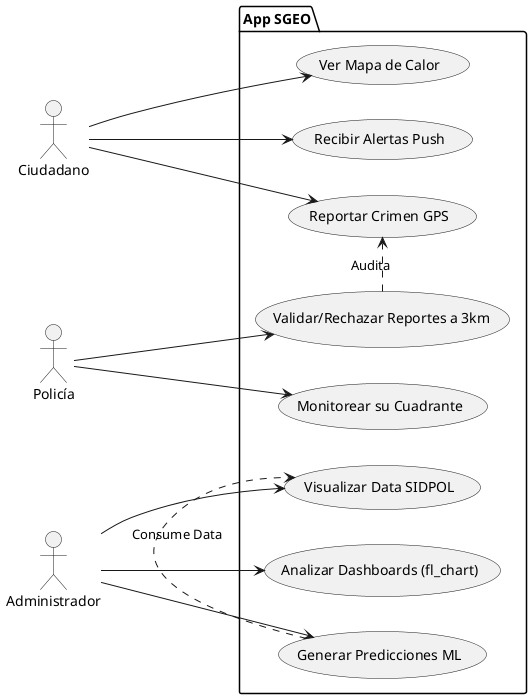
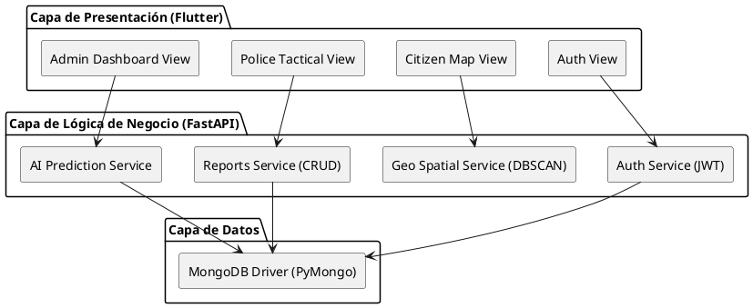
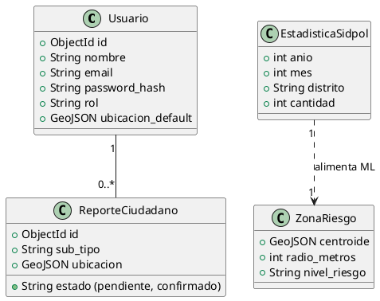
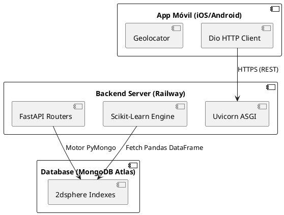
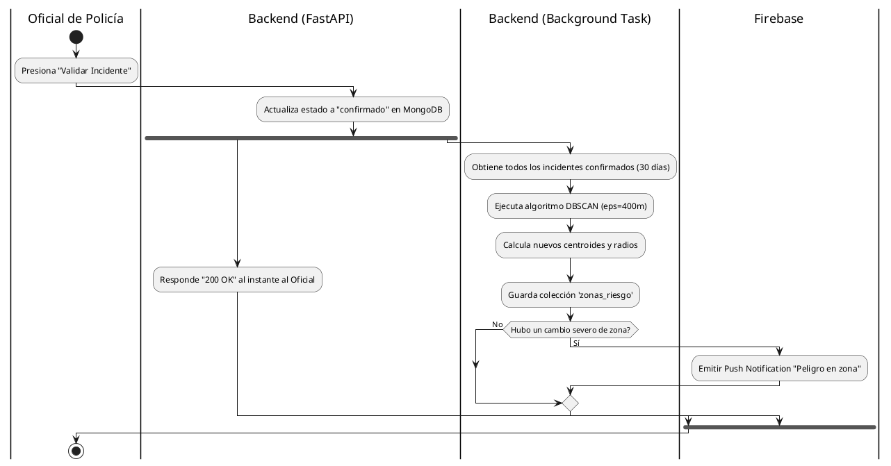
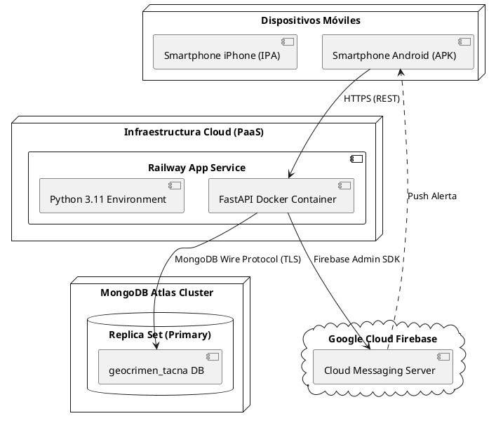

**UNIVERSIDAD PRIVADA DE TACNA**  
**FACULTAD DE INGENIERÍA**  
**Escuela Profesional de Ingeniería de Sistemas**  

**Proyecto: "SGEO — Sistema de Geolocalización de Inseguridad Ciudadana con Machine Learning Predictivo y Espacial"**  

**Curso:** Construcción De Software II  
**Docente:** Alberto Johnatan Flor Rodriguez  

**Integrante:**  
- Piero Alexander Paja de la Cruz (2020067576)

**Tacna -- Perú**  
**2026**  

---

**Documento de Arquitectura de Software (SAD)**  
**Versión:** 1.0  

### CONTROL DE VERSIONES

| Versión | Hecha por | Revisada por | Aprobada por | Fecha      | Motivo                             |
|---------|-----------|--------------|--------------|------------|------------------------------------|
| 1.0     | PP        | PP           | AF           | 13/03/2026 | Creación Inicial - Contexto SGEO   |

---

## ÍNDICE GENERAL

1. [Introducción](#1-introducción)
2. [Representación Arquitectónica](#2-representación-arquitectónica)
3. [Objetivos y Restricciones Arquitectónicas](#3-objetivos-y-restricciones-arquitectónicas)
4. [Vista de Casos de Uso](#4-vista-de-casos-de-uso)
5. [Vista Lógica](#5-vista-lógica)
6. [Vista de Implementación](#6-vista-de-implementación)
7. [Vista de Procesos](#7-vista-de-procesos)
8. [Vista de Despliegue](#8-vista-de-despliegue)
9. [Calidad del Software](#9-calidad-del-software)
10. [Decisiones Arquitectónicas](#10-decisiones-arquitectónicas)
11. [Tamaño y Rendimiento](#11-tamaño-y-rendimiento)

---

## 1. Introducción

### 1.1. Propósito
El presente Documento de Arquitectura de Software (SAD) describe la arquitectura técnica del **Sistema SGEO**, una plataforma predictiva de inseguridad ciudadana. Sirve como un plano arquitectónico exhaustivo (incluyendo diagramas UML, APIs y modelos lógicos) para comunicar las decisiones tecnológicas al equipo de desarrollo, a la plana docente de la UPT y a los stakeholders (Policía Nacional y Municipalidad).

### 1.2. Alcance
Cubre el diseño arquitectónico del **Frontend** (Aplicación Móvil en Flutter), el **Backend** (API RESTful en FastAPI con Machine Learning), la **Capa de Persistencia** (MongoDB Atlas) y los **Servicios de Nube** externos (Firebase Cloud Messaging).

### 1.3. Definiciones, Siglas y Abreviaturas
- **SAD:** Software Architecture Document.
- **SGEO:** Sistema de Geolocalización de Inseguridad Ciudadana.
- **DBSCAN:** Algoritmo de clustering espacial basado en densidad.
- **MVC/MVT:** Patrones de arquitectura Model-View-Controller.
- **FCM:** Firebase Cloud Messaging.

### 1.4. Referencias
- Patrones de Arquitectura Empresarial (Martin Fowler).
- Documentación Oficial de FastAPI (Asynchronous Python).
- Documentación del Framework Flutter (Dart).

---

## 2. Representación Arquitectónica

### 2.1. Modelo de Vistas
Se ha documentado el sistema utilizando un **Enfoque de Arquitectura en Capas (Layered Architecture)** y un modelo tipo C4 modificado para reflejar la estructura real del repositorio:
1. **Vista de Contexto / Casos de Uso:** Relación de los actores (Policía, Administrador, Ciudadano) con el sistema central de SGEO y los servicios en la nube.
2. **Vista Lógica (Contenedores):** Separación en módulos independientes: Frontend (Aplicación Móvil en Flutter), Backend (API REST en FastAPI) y Persistencia (MongoDB Atlas).
3. **Vista de Implementación (Componentes):** Cómo el código fuente está agrupado en el repositorio (Ej: directorios `core`, `roles` en Flutter y los `Routers` en Python).
4. **Vista de Procesos:** Orquestación y concurrencia asíncrona, documentando cómo FastAPI procesa la Inteligencia Artificial (DBSCAN y ML) en tareas en segundo plano.
5. **Vista de Despliegue:** Mapa de la infraestructura técnica donde se ejecuta el código en producción (PaaS Railway, AWS y Firebase).

### 2.2. Patrones Arquitectónicos Aplicados
- **Cliente-Servidor (Client-Server):** Desacoplamiento total entre la App Móvil (Cliente) y la API Central (Servidor).
- **Clean Architecture (Frontend):** Separación en Flutter entre `core`, `features`, `theme` y `roles`.
- **Arquitectura Basada en Eventos:** Uso de *Push Notifications* y Tareas en Segundo Plano (*BackgroundTasks* en FastAPI) para no bloquear el `Event Loop`.

### 2.3. Tecnologías Utilizadas
- **Frontend:** Flutter v3+, Dart, `flutter_map`, `fl_chart`.
- **Backend:** Python 3.11+, FastAPI, Uvicorn, Scikit-Learn (ML), Pandas.
- **Base de Datos:** MongoDB Atlas (M0/M10 Cluster) con índices `2dsphere`.
- **Integraciones:** Firebase Admin SDK, Bcrypt.

---

## 3. Objetivos y Restricciones Arquitectónicas

### 3.1. Objetivos de Software
- **Alta Cohesión y Bajo Acoplamiento:** Cada módulo del Backend (Auth, Dashboards, Machine Learning, Reportes) opera de manera independiente a través de Routers de FastAPI.
- **Latencia Mínima Espacial:** Las consultas geográficas (`$near`) deben responder en milisegundos incluso con miles de reportes.

### 3.2. Restricciones Tecnológicas
- **Lenguaje:** Obligatoriedad de usar Python en el Backend para garantizar la compatibilidad matemática con las librerías `scikit-learn` y `pandas`.
- **Persistencia:** Requerimiento estricto de base de datos NoSQL con soporte geoespacial nativo (MongoDB).
- **Costo:** Maximizar el uso de capa gratuita (PaaS como Railway y MongoDB Atlas) para mantener el presupuesto por debajo de S/ 2,000 mensuales en infraestructura.

---

## 4. Vista de Casos de Uso

### 4.1. Diagrama de Casos de Uso General


---

## 5. Vista Lógica

### 5.1. Arquitectura de Alto Nivel


### 5.2. Modelo de Base de Datos (Diagrama de Clases)


---

## 6. Vista de Implementación

### 6.1. Estructura de Directorios del Repositorio
**Frontend (Flutter):**
```
sgeo_pp/
├── lib/
│   ├── core/         # Servicios base, HTTP, Utils, Theme
│   ├── features/     # Auth, Onboarding (Módulos transversales)
│   ├── roles/        # Separación estricta (admin/, citizen/, police/)
│   └── main.dart     # Punto de entrada y Router principal
```

**Backend (Python/FastAPI):**
```
backend/
├── api/
│   ├── auth.py       # JWT Login
│   ├── ciudadano.py  # Rutas de civil
│   ├── admin.py      # Rutas de administrador e Inteligencia Artificial
│   └── policia.py    # Rutas de validación
├── models/           # Pydantic schemas (validación estricta de JSON)
├── scripts_iniciales/ # setup_db.py y scripts de ETL para SIDPOL
├── database.py       # Conexión PyMongo singleton
└── main.py           # Instancia FastAPI y middleware CORS
```

### 6.2. Diagrama de Componentes


---

## 7. Vista de Procesos

### 7.1. Diagrama de Actividad: Generación de Zonas Rojas (DBSCAN)
El procesamiento espacial corre en background para no interrumpir al oficial de policía que acaba de validar un incidente.


---

## 8. Vista de Despliegue

### 8.1. Arquitectura Cloud e Infraestructura


### 8.2. Especificaciones Técnicas
- **Servidor API:** Instancia Railway con 1GB RAM y 1vCPU. Entorno aislado en Docker `python:3.11-slim`.
- **Base de Datos:** MongoDB Atlas M10 (Cluster dedicado o capa gratuita optimizada), desplegado en AWS `us-east-1` (Virginia) para menor latencia con Perú.
- **Canal Seguro:** Todos los endpoints están resguardados por certificados TSL/SSL provistos automáticamente por la plataforma Railway.

---

## 9. Calidad del Software
- **Testabilidad:** Separación de Pydantic Models y Controllers facilita la inyección de dependencias para `pytest`.
- **Mantenibilidad:** El uso del patrón Repository (Manejadores directos de BD) en `database.py` previene el espagueti code en los endpoints de FastAPI.
- **Performance:** Al delegar los cálculos pesados de Scikit-Learn a la librería C underlying (Numpy), el Event Loop de Python nunca se bloquea, logrando métricas de *High-Concurrency*.

## 10. Decisiones Arquitectónicas
- **¿Por qué Flutter y no React Native?** Flutter provee un motor de renderizado propio (Skia/Impeller) que asegura 60 FPS estables al dibujar cientos de polígonos geoespaciales (hotspots criminales), algo en lo que React Native sufre pérdida de *frames*.
- **¿Por qué FastAPI en lugar de Node.js?** Si bien Node.js es rápido para E/S, SGEO requiere ejecutar Modelos Predictivos y DBSCAN. Python es el estándar de oro en Inteligencia Artificial y FastAPI permite exponer esos modelos asíncronamente en una sola pieza de infraestructura.

## 11. Tamaño y Rendimiento
- **Métricas Esperadas:**
  - Ingesta de 500,000 registros históricos de SIDPOL procesados en memoria (Pandas) en menos de 5 segundos de entrenamiento en servidor.
  - El peso del aplicativo Móvil final optimizado (AppBundle para Android) es estimado a `< 30 MB`.
  - Capacidad para atender hasta 2,000 conexiones concurrentes gracias al servidor ASGI Uvicorn.
