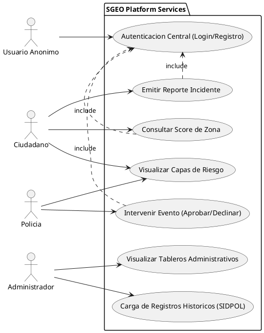
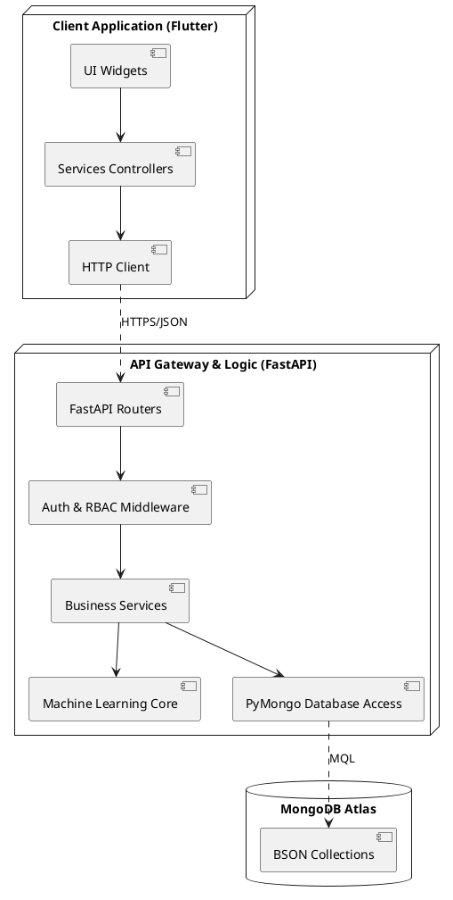
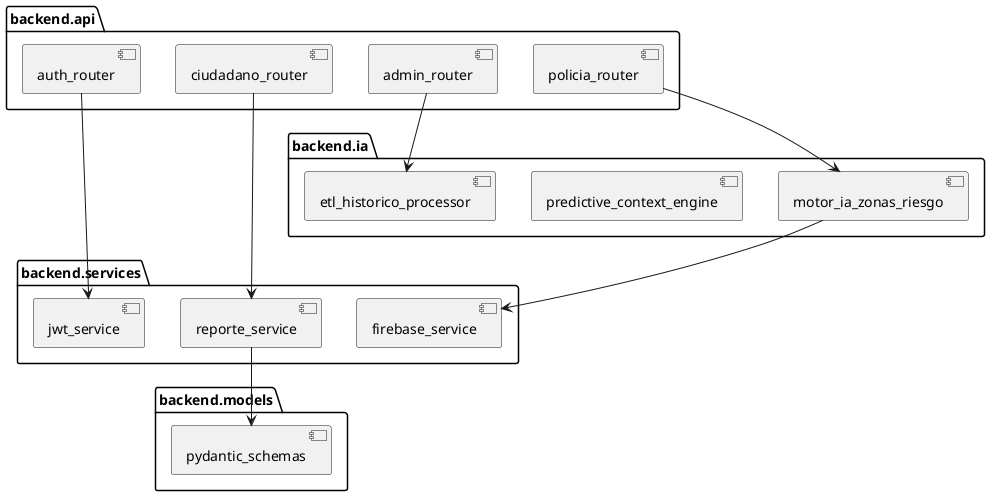
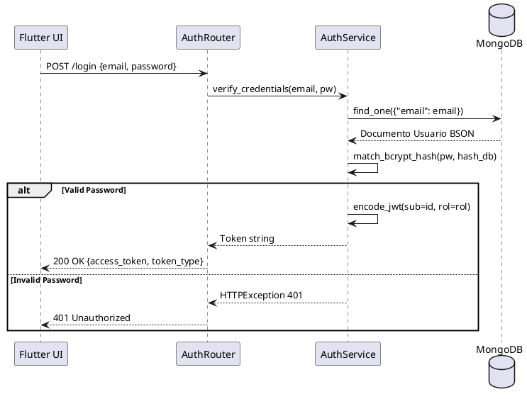
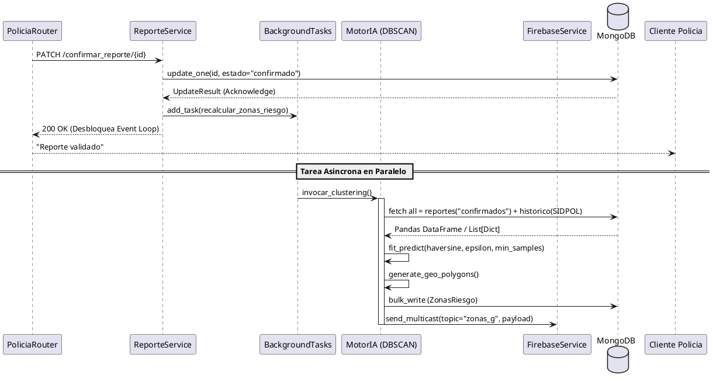
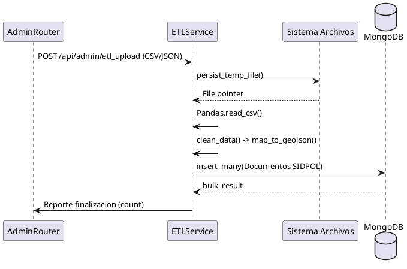
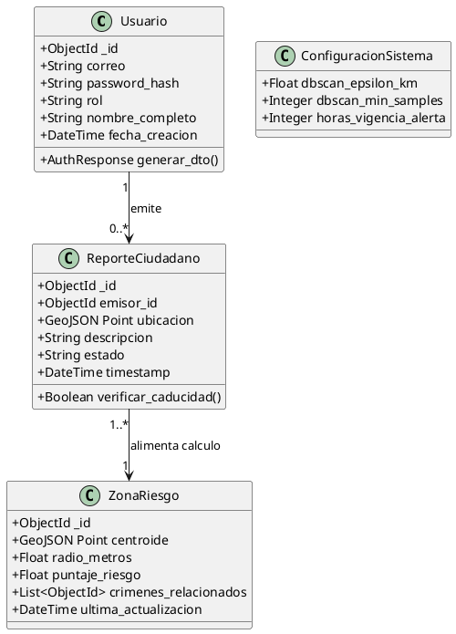
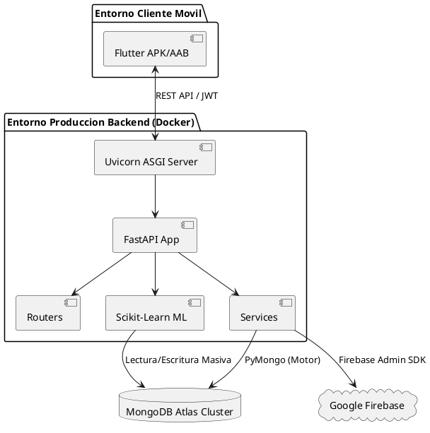
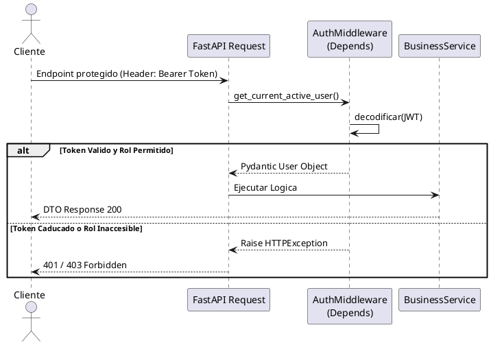
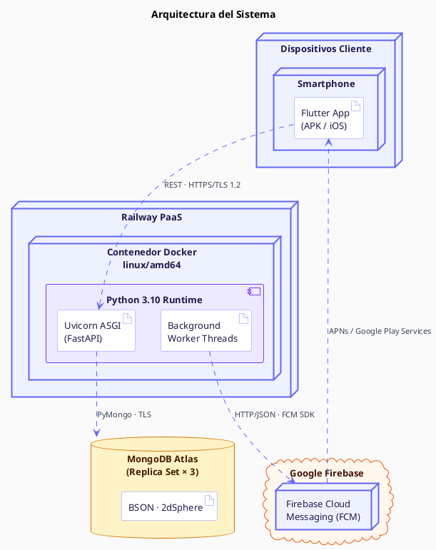

**UNIVERSIDAD PRIVADA DE TACNA**  
**FACULTAD DE INGENIERIA**  
**Escuela Profesional de Ingenieria de Sistemas**  

**Proyecto: "SGEO - Sistema de Geolocalizacion de Inseguridad Ciudadana con Analisis Predictivo y Espacial"**  

**Curso:** Construccion De Software II  
**Docente:** Alberto Johnatan Flor Rodriguez  

**Integrante:**  
- Piero Alexander Paja de la Cruz (2020067576)

**Tacna -- Peru**  
**2026**  

---

**Documento de Arquitectura de Software (SAD)**  
**Version:** 3.0 (Alineacion Integral estandar IEEE 42010)

---

# INDICE GENERAL

- [1. Introduccion](#1-introduccion)
  - [1.1 Proposito](#11-proposito)
  - [1.2 Alcance](#12-alcance)
  - [1.3 Definiciones, Siglas y Abreviaturas](#13-definiciones-siglas-y-abreviaturas)
  - [1.4 Referencias](#14-referencias)
  - [1.5 Organizacion del documento](#15-organizacion-del-documento)
- [2. Representacion Arquitectonica](#2-representacion-arquitectonica)
  - [2.1 Modelo de Vistas](#21-modelo-de-vistas)
  - [2.2 Patrones Arquitectonicos Aplicados](#22-patrones-arquitectonicos-aplicados)
  - [2.3 Tecnologias Utilizadas](#23-tecnologias-utilizadas)
- [3. Objetivos y Restricciones Arquitectonicas](#3-objetivos-y-restricciones-arquitectonicas)
  - [3.1 Objetivos de Software](#31-objetivos-de-software)
  - [3.2 Restricciones Tecnologicas](#32-restricciones-tecnologicas)
  - [3.3 Priorizacion de Requerimientos](#33-priorizacion-de-requerimientos)
- [4. Vista de Casos de Uso](#4-vista-de-casos-de-uso)
  - [4.1 Diagrama de Casos de Uso General](#41-diagrama-de-casos-de-uso-general)
  - [4.2 Actores del Sistema](#42-actores-del-sistema)
  - [4.3 Especificacion de Casos de Uso](#43-especificacion-de-casos-de-uso)
- [5. Vista Logica](#5-vista-logica)
  - [5.1 Arquitectura de Alto Nivel](#51-arquitectura-de-alto-nivel)
  - [5.2 Diagrama de Paquetes/Subsistemas](#52-diagrama-de-paquetessubsistemas)
  - [5.3 Diagramas de Secuencia](#53-diagramas-de-secuencia)
  - [5.4 Diagrama de Clases del Dominio](#54-diagrama-de-clases-del-dominio)
- [6. Vista de Implementacion](#6-vista-de-implementacion)
  - [6.1 Diagrama de Componentes](#61-diagrama-de-componentes)
  - [6.2 Estructura de Directorios](#62-estructura-de-directorios-repositorio-logico)
  - [6.3 Configuracion de Servicios](#63-configuracion-de-servicios)
- [7. Vista de Procesos](#7-vista-de-procesos)
  - [7.1 Arquitectura Basada en Roles (Flujo RBAC)](#71-arquitectura-basada-en-roles-flujo-rbac)
  - [7.2 Procesos Criticos del Sistema](#72-procesos-criticos-del-sistema-analitica-de-prediccion-score)
- [8. Vista de Despliegue](#8-vista-de-despliegue)
  - [8.1 Diagrama de Despliegue Empresarial](#81-diagrama-de-despliegue-empresarial)
  - [8.2 Especificaciones Tecnicas](#82-especificaciones-tecnicas)
- [9. Calidad del Software](#9-calidad-del-software)
- [10. Decisiones Arquitectonicas](#10-decisiones-arquitectonicas)
- [11. Tamanio y Rendimiento](#11-tamanio-y-rendimiento)

---

## 1. Introduccion

### 1.1 Proposito
Este Documento de Arquitectura de Software (SAD) provee una descripcion abstracta y exhaustiva de la arquitectura del Sistema de Geolocalizacion de Inseguridad Ciudadana (SGEO). Define las estructuras, interfaces y componentes que conforman la aplicacion, sirviendo como guia estricta para el equipo de desarrollo, mantenimiento y validacion. Su enfoque asegura el cumplimiento normativo acorde a las especificaciones trazadas en el Software Requirements Specification (SRS).

### 1.2 Alcance
El documento cubre el diseno logico, la persistencia, la logica de negocio en el backend (FastAPI), la implementacion movil (Flutter) y los flujos de integracion de analitica de datos (DBSCAN y ETL). No incluye el codigo fuente explicito, sino la abstraccion de los modulos, las reglas de integracion y el despliegue en infraestructura de produccion.

### 1.3 Definiciones, Siglas y Abreviaturas
- **SAD:** Software Architecture Document.
- **SRS:** Software Requirements Specification.
- **DBSCAN:** Density-Based Spatial Clustering of Applications with Noise. Algoritmo no parametrico para clustering.
- **ETL:** Extract, Transform, Load. Proceso para importar origenes historicos (SIDPOL).
- **JWT:** JSON Web Token. Estructura de autenticacion de estado descentralizado.
- **FCM:** Firebase Cloud Messaging. Plataforma para envio de notificaciones push.
- **RBAC:** Role-Based Access Control. Manejo de dominios de autorizacion.

### 1.4 Referencias
- IEEE Std 42010-2011: Systems and software engineering - Architecture description.
- Kruchten, P. (1995). The 4+1 View Model of Architecture.
- Documentacion oficial de FastAPI (Uvicorn, Starlette).
- Documentacion de MongoDB (Geospatial Queries, BSON).

### 1.5 Organizacion del documento
El documento adopta el Modelo de Vistas 4+1 (Logica, Implementacion, Procesos, Despliegue y Casos de Uso) estandarizado, complementado con secciones obligatorizadas para el aseguramiento de la calidad y justificacion de decisiones arquitectonicas.

---

## 2. Representacion Arquitectonica

### 2.1 Modelo de Vistas
SGEO se fundamenta en un modelo de capas acoplado al estandar 4+1 de Kruchten:
- **Vista de Casos de Uso:** Identifica como los actores interactuan con el entorno y sus barreras (Auth).
- **Vista Logica:** Abstrae las colecciones MongoDB a Modelos Pydantic y las transacciones hacia los Servicios.
- **Vista de Implementacion:** Divide el codigo fuente entre los subdirectorios cliente (`lib/` en Dart) y servidor (`backend/` en Python).
- **Vista de Procesos:** Detalla la ejecucion de hilos en asincronia paralela (ej. `BackgroundTasks` en Python para modelos de machine learning).
- **Vista de Despliegue:** Ubicacion de contenedores Docker instanciados sobre Railway hacia el cluster de Atlas.

### 2.2 Patrones Arquitectonicos Aplicados
- **Arquitectura Cliente-Servidor (REST):** Protocolo fundamental de estado representacional con verbos HTTP estrictos.
- **Arquitectura N-Capas (N-Tier):** En el backend se segrega la presentacion (Routers), la logica de dominio (Services) y el acceso a datos (Repositorios PyMongo).
- **Patron Observer/Pub-Sub (FCM):** Para la distribucion masiva de las alertas de Geofencing hacia receptores flutter registrados.

### 2.3 Tecnologias Utilizadas
- **Backend:** Python 3.10+, FastAPI, Pydantic, Passlib, Uvicorn.
- **Analitica de Datos:** Scikit-Learn, Pandas, Numpy.
- **Base de Datos:** MongoDB Atlas (Capa M0/M10, Indices 2dsphere).
- **Frontend:** Dart 3.x, Flutter, Provider/Riverpod (State Management), flutter_map.
- **Infraestructura:** Docker, Railway, Firebase Admin SDK.

---

## 3. Objetivos y Restricciones Arquitectonicas

### 3.1 Objetivos de Software
- **Bajo Acoplamiento Backend:** Modulos como `auth`, `reportes` y `estadisticas` se estructuran en `APIRouter` independientes.
- **Alta Tolerancia de I/O:** Mediante concurrencia asincrona (async/await), el servicio debe despachar transacciones a BD sin bloquear el Event Loop.

### 3.2 Restricciones Tecnologicas
- **Global Interpreter Lock (GIL):** Python impide verdadera ejecucion multiproceso en una sola instancia. Los calculos pesados de DBSCAN deben derivarse a tareas ejecutadas con `BackgroundTasks` de FastAPI o procesos desacoplados.
- **Consumo Restringido en Cliente:** La integracion geoespacial en moviles (`Geolocator`) impacta la bateria; se restringe el sondeo a tiempos fijos parametrizados o solicitud directa de la UI.

### 3.3 Priorizacion de Requerimientos
1. Persistencia de reportes geoespaciales inmutables.
2. Autorizacion estricta (JWT + RBAC).
3. Resilencia temporal frente a calculos espaciales defectuosos en etapa ML.

---

## 4. Vista de Casos de Uso

### 4.1 Diagrama de Casos de Uso General


```plantuml
@startuml
skinparam shadowing false
left to right direction

actor "Usuario Anonimo" as Anon
actor Ciudadano
actor Policia
actor Administrador

package "SGEO Platform Services" {
  usecase "Autenticacion Central (Login/Registro)" as UC_Auth
  usecase "Emitir Reporte Incidente" as UC_Rep
  usecase "Visualizar Capas de Riesgo" as UC_Map
  usecase "Consultar Score de Zona" as UC_Score
  usecase "Intervenir Evento (Aprobar/Declinar)" as UC_Eval
  usecase "Visualizar Tableros Administrativos" as UC_Dash
  usecase "Carga de Registros Historicos (SIDPOL)" as UC_ETL
}

Anon --> UC_Auth
Ciudadano --> UC_Rep
Ciudadano --> UC_Map
Ciudadano --> UC_Score
Policia --> UC_Map
Policia --> UC_Eval
Administrador --> UC_Dash
Administrador --> UC_ETL

UC_Score .> UC_Auth : include
UC_Rep .> UC_Auth : include
UC_Eval .> UC_Auth : include
@enduml
```

### 4.2 Actores del Sistema
- **Usuario Anonimo:** Solo posee persistencia base interactuando con metodos POST para registro.
- **Ciudadano (Rol 1):** Acceso GET a datos procesados; POST limitado a su propiedad sobre "ReporteCiudadano".
- **Policia (Rol 2):** Permiso de lectura geolocalizada `$near` y modificacion (PATCH) de estado de alerta.
- **Administrador (Rol 3):** Visibilidad global de los flujos de lectura transversal; ejecucion del ETL.

### 4.3 Especificacion de Casos de Uso
Referirse al documento SRS, Seccion IV.c para la especificacion exhaustiva tabulada.

---

## 5. Vista Logica

### 5.1 Arquitectura de Alto Nivel
SGEO aisla la logica de persistencia empleando el patron de Capas. La capa front (Flutter) ignora absolutamente toda interaccion BSON, enlazada netamente mediante interfaces JSON sobre HTTPS provistas por Pydantic.


```plantuml
@startuml
skinparam shadowing false
node "Client Application (Flutter)" {
  [UI Widgets] --> [Services Controllers]
  [Services Controllers] --> [HTTP Client]
}
node "API Gateway & Logic (FastAPI)" {
  [HTTP Client] ..> [FastAPI Routers] : HTTPS/JSON
  [FastAPI Routers] --> [Auth & RBAC Middleware]
  [Auth & RBAC Middleware] --> [Business Services]
  [Business Services] --> [Machine Learning Core]
  [Business Services] --> [PyMongo Database Access]
}
database "MongoDB Atlas" {
  [PyMongo Database Access] ..> [BSON Collections] : MQL
}
@enduml
```

### 5.2 Diagrama de Paquetes/Subsistemas


```plantuml
@startuml
skinparam shadowing false

package "backend.api" {
  [auth_router]
  [ciudadano_router]
  [policia_router]
  [admin_router]
}

package "backend.services" {
  [jwt_service]
  [reporte_service]
  [firebase_service]
}

package "backend.ia" {
  [motor_ia_zonas_riesgo]
  [predictive_context_engine]
  [etl_historico_processor]
}

package "backend.models" {
  [pydantic_schemas]
}

[auth_router] --> [jwt_service]
[ciudadano_router] --> [reporte_service]
[policia_router] --> [motor_ia_zonas_riesgo]
[admin_router] --> [etl_historico_processor]

[reporte_service] --> [pydantic_schemas]
[motor_ia_zonas_riesgo] --> [firebase_service]
@enduml
```

### 5.3 Diagramas de Secuencia

#### 5.3.1 Flujo de Autenticacion JWT

```plantuml
@startuml
skinparam shadowing false
participant "Flutter UI" as UI
participant "AuthRouter" as Router
participant "AuthService" as Service
database "MongoDB" as DB

UI -> Router: POST /login {email, password}
Router -> Service: verify_credentials(email, pw)
Service -> DB: find_one({"email": email})
DB --> Service: Documento Usuario BSON
Service -> Service: match_bcrypt_hash(pw, hash_db)
alt Valid Password
    Service -> Service: encode_jwt(sub=id, rol=rol)
    Service --> Router: Token string
    Router --> UI: 200 OK {access_token, token_type}
else Invalid Password
    Service --> Router: HTTPException 401
    Router --> UI: 401 Unauthorized
end
@enduml
```

#### 5.3.2 Flujo DBSCAN y Notificaciones FCM

```plantuml
@startuml
skinparam shadowing false
participant "PoliciaRouter" as Router
participant "ReporteService" as Service
participant "BackgroundTasks" as BG
participant "MotorIA (DBSCAN)" as Motor
participant "FirebaseService" as FCM
database "MongoDB" as DB

Router -> Service: PATCH /confirmar_reporte/{id}
Service -> DB: update_one(id, estado="confirmado")
DB --> Service: UpdateResult (Acknowledge)
Service -> BG: add_task(recalcular_zonas_riesgo)
Service --> Router: 200 OK (Desbloquea Event Loop)
Router --> "Cliente Policia": "Reporte validado"

== Tarea Asincrona en Paralelo ==
BG -> Motor: invocar_clustering()
activate Motor
Motor -> DB: fetch all = reportes("confirmados") + historico(SIDPOL)
DB --> Motor: Pandas DataFrame / List[Dict]
Motor -> Motor: fit_predict(haversine, epsilon, min_samples)
Motor -> Motor: generate_geo_polygons()
Motor -> DB: bulk_write (ZonasRiesgo)
Motor -> FCM: send_multicast(topic="zonas_g", payload)
deactivate Motor
@enduml
```

#### 5.3.3 Flujo Integracion Analitica ETL (SIDPOL)

```plantuml
@startuml
skinparam shadowing false
participant "AdminRouter" as Router
participant "ETLService" as ETL
participant "Sistema Archivos" as FS
database "MongoDB" as DB

Router -> ETL: POST /api/admin/etl_upload (CSV/JSON)
ETL -> FS: persist_temp_file()
FS --> ETL: File pointer
ETL -> ETL: Pandas.read_csv()
ETL -> ETL: clean_data() -> map_to_geojson()
ETL -> DB: insert_many(Documentos SIDPOL)
DB --> ETL: bulk_result
ETL -> Router: Reporte finalizacion (count)
@enduml
```

### 5.4 Diagrama de Clases del Dominio


```plantuml
@startuml
skinparam shadowing false
skinparam classAttributeIconSize 0

class Usuario {
  + ObjectId _id
  + String correo
  + String password_hash
  + String rol
  + String nombre_completo
  + DateTime fecha_creacion
  + AuthResponse generar_dto()
}

class ReporteCiudadano {
  + ObjectId _id
  + ObjectId emisor_id
  + GeoJSON Point ubicacion
  + String descripcion
  + String estado
  + DateTime timestamp
  + Boolean verificar_caducidad()
}

class ZonaRiesgo {
  + ObjectId _id
  + GeoJSON Point centroide
  + Float radio_metros
  + Float puntaje_riesgo
  + List<ObjectId> crimenes_relacionados
  + DateTime ultima_actualizacion
}

class ConfiguracionSistema {
  + Float dbscan_epsilon_km
  + Integer dbscan_min_samples
  + Integer horas_vigencia_alerta
}

Usuario "1" --> "0..*" ReporteCiudadano : emite
ReporteCiudadano "1..*" --> "1" ZonaRiesgo : alimenta calculo
@enduml
```

---

## 6. Vista de Implementacion

### 6.1 Diagrama de Componentes


```plantuml
@startuml
skinparam shadowing false

package "Entorno Cliente Movil" {
  component [Flutter APK/AAB] as UI
}

package "Entorno Produccion Backend (Docker)" {
  component [Uvicorn ASGI Server] as Uvicorn
  component [FastAPI App] as FastAPI
  component [Routers] as Routers
  component [Services] as Services
  component [Scikit-Learn ML] as ML
}

database "MongoDB Atlas Cluster" as Mongo
cloud "Google Firebase" as Firebase

UI <--> Uvicorn : REST API / JWT
Uvicorn --> FastAPI
FastAPI --> Routers
FastAPI --> Services
FastAPI --> ML
Services --> Mongo : PyMongo (Motor)
ML --> Mongo : Lectura/Escritura Masiva
Services --> Firebase : Firebase Admin SDK
@enduml
```


### 6.2 Estructura de Directorios (Repositorio Logico)

```text
sgeo_pp/
|-- android/                     # Dependencias Gradle / Compilacion nativa
|-- ios/                         # Workspace Xcode para entorno Apple
|-- lib/                         # Codigo Flutter (Client Logic)
|   |-- core/                    # Logica transversal HTTP, Config, Routing
|   |-- features/                # Utilidades de UI compartidas
|   |-- roles/                   # UI dividida por Modulos RBAC
|   |-- firebase_options.dart    # Configuraciones Firebase Client SDK
|   +-- main.dart                # Setup inicial y providers de Dart
|-- backend/                     # Microservicio, IA y Data
|   |-- scripts_iniciales/       # Procesos ETL y configuracion base (SIDPOL)
|   |-- firebase_service.py      # Interfaz backend para Firebase Cloud Messaging
|   |-- main.py                  # Instancia principal FastAPI y Routers
|   |-- motor_ia_zonas_riesgo.py # Logica clustering espacial DBSCAN
|   |-- predictive_context_engine.py # Analisis heuristico temporal
|   |-- predictive_routes.py     # Controladores Geoespaciales
|   |-- requirements.txt         # Dependencias Pip (FastAPI, PyMongo, scikit-learn)
|   +-- Procfile                 # Comandos para inicializacion en Railway
+-- pubspec.yaml                 # Core dependencias de interface (Flutter)
```

### 6.3 Configuracion de Servicios
- **CORS:** Habilitado irrestrictamente para origenes de desarrollo movil en entorno Dev; restringido a direcciones de confianza en Produccion.
- **Variables de Entorno (.env):** `MONGO_URI`, `JWT_SECRET_KEY`, `ALGORITHM`, `ACCESS_TOKEN_EXPIRE_MINUTES`, credenciales JSON de Firebase `sgeo-firebase-adminsdk.json`.

---

## 7. Vista de Procesos

### 7.1 Arquitectura Basada en Roles (Flujo RBAC)


```plantuml
@startuml
skinparam shadowing false
actor Cliente
participant "FastAPI Request" as API
participant "AuthMiddleware\n(Depends)" as MID
participant "BusinessService" as SRV

Cliente -> API: Endpoint protegido (Header: Bearer Token)
API -> MID: get_current_active_user()
MID -> MID: decodificar(JWT)
alt Token Valido y Rol Permitido
    MID --> API: Pydantic User Object
    API -> SRV: Ejecutar Logica
    SRV --> Cliente: DTO Response 200
else Token Caducado o Rol Inaccesible
    MID --> API: Raise HTTPException
    API --> Cliente: 401 / 403 Forbidden
end
@enduml
```

### 7.2 Procesos Criticos del Sistema: Analitica de Prediccion (Score)

El proceso de estimacion temporal cruza distancias metricas hacia puntos criticos confirmados con variacion temporal. Requiere alta fidelidad en el query NoSQL `$near`. Este metodo se acompana de una metrica heuristica calculada en `predictive_context_engine.py`.

---

## 8. Vista de Despliegue

### 8.1 Diagrama de Despliegue


```plantuml
@startuml
skinparam shadowing false
skinparam backgroundColor #FAFAFA
skinparam defaultFontName Arial
skinparam defaultFontSize 13

skinparam node {
  BackgroundColor #EEF2FF
  BorderColor #6366F1
  FontColor #1E1B4B
  BorderThickness 2
}

skinparam artifact {
  BackgroundColor #FFFFFF
  BorderColor #818CF8
  FontColor #1E1B4B
}

skinparam database {
  BackgroundColor #FEF3C7
  BorderColor #D97706
  FontColor #451A03
}

skinparam cloud {
  BackgroundColor #FFF7ED
  BorderColor #EA580C
  FontColor #431407
}

skinparam component {
  BackgroundColor #EDE9FE
  BorderColor #7C3AED
  FontColor #1E1B4B
}

skinparam arrow {
  Color #6366F1
  FontColor #374151
  FontSize 11
}

title Arquitectura del Sistema

node "Dispositivos Cliente" {
  node "Smartphone" {
    artifact "Flutter App\n(APK / iOS)" as Movil
  }
}

node "Railway PaaS" {
  node "Contenedor Docker\nlinux/amd64" as Docker {
    component "Python 3.10 Runtime" as Runtime {
      artifact "Uvicorn ASGI\n(FastAPI)" as Uvicorn
      artifact "Background\nWorker Threads" as Worker
    }
  }
}

database "MongoDB Atlas\n(Replica Set × 3)" as Mongo {
  artifact "BSON · 2dSphere" as BSON
}

cloud "Google Firebase" as GCloud {
  node "Firebase Cloud\nMessaging (FCM)" as FCM
}

Movil   ..>  Uvicorn : REST · HTTPS/TLS 1.2
Uvicorn ..>  Mongo   : PyMongo · TLS
Worker  ..>  FCM     : HTTP/JSON · FCM SDK
FCM     ..>  Movil   : APNs / Google Play Services

@enduml
```

### 8.2 Especificaciones Tecnicas
- **Contenedores de Aplicacion:** Servidor construido sobre imagen base oficial `python:3.10-slim`. Administracion de recursos dependiente del hardware del contenedor PaaS en Railway (1GB RAM recomendada como limite vital para Scikit-Learn).
- **Cluster MongoDB:** Entorno gestionado (Atlas), tolerante a caidas mediante arquitectura Replica Set que certifica Alta Disponibilidad.
- **Redes y Resolucion:** Enrutamiento DNS automatizado. Toda transferencia serializada esta configurada estrictamente bajo capa encriptada TLS de 256 bits.

---

## 9. Calidad del Software

- **Escalabilidad Horizontal:** Debido a la naturaleza estandar HTTP REST sin guardar estado del lado del servidor (Stateless), FastAPI puede desplegar multiples web-workers detras de un balanceador de carga.
- **Mantenibilidad:** Separacion inquebrantable de modelos (`models/`) respecto a rutas (`api/`) propicia pruebas unitarias agiles por dependencias.
- **Rendimiento Optimo en Lectura Geoespacial:** Uso mandatorio del estandar geoespacial GeoJSON coordinado con indices tipo `2dsphere` para delegar la busqueda cartesiana al motor de C++ subyacente en Mongo, omitiendo castigar a Python con dichas iteraciones matriciales iniciales.
- **Seguridad Logica:** Empleo de dependencias OAuth2 incorporadas nativamente en Starlette/FastAPI, invalidando de plano el secuestro de sesiones.

---

## 10. Decisiones Arquitectonicas

1. **Eleccion de Python / FastAPI vs Node.js:** Se escogio Python dado su rol absoluto como estandar en ciencia de datos. Replicar DBSCAN en entornos JavaScript conllevaria sobreescribir linderos ineficientes. FastAPI suple los problemas de la barrera de transaccion bloqueante que sufria Flask y Django en esquemas anteriores.
2. **Eleccion de MongoDB vs PostGIS (PostgreSQL):** La dinamica organica de datos Json transferidos desde moviles se adecua inmejorablemente al estandar BSON sin necesidad de traductores ORM (Object-Relational Mapping). El motor `2dsphere` es suficiente para los limites cartograficos de este alcance.
3. **Eleccion de Flutter vs React Native:** Flutter integra el motor de renderizado Skia capaz de soportar graficado cartografico multipoligonal asincrono (`flutter_map`) sosteniendo metricas cercanas a los 60 fps invariables, esquivando asi el puente nativo JS Bridge costoso de alternativas hibridas.
4. **Justificacion de Scikit-Learn DBSCAN:** Modelos alternos como K-Means requieren determinar el numero de clusters previamente (lo cual es falaz en entornos de criminalidad desconocida). DBSCAN parametriza exclusivamente la proximidad geofisica y la densidad de incidentes para auto-descubrir clusters criminales con ruido.
5. **Autenticacion basada en RBAC embebido via Headers:** Ocultacion frontal de rutas en UI y purga automatica via codigo HTTP 403. Simplifica despliegues en clientes delgados no autorizados.

---

## 11. Tamanio y Rendimiento

La arquitectura asegura metas realistas y prudentes basadas en analisis estandar de librerias de integracion de datos modernas bajo infraestructuras basicas:
- **Latencia Maxima Estimada de Servicio Base:** Resuelve endpoints genericos (`GET /usuarios`) en <= 80 ms, considerando red peruana y centro de datos AWS Virginia.
- **Latencia Limite Modelos Analiticos Espaciales:** Calculo de riesgo directo en via HTTP en limite sub-250ms (busquedas compuestas `$near` BSON).
- **Procesamiento de Archivos Pesados Offline (SIDPOL):** Pandas es funcional e iterara sets tabulares de formato CSV/Json de ~30,000 incidentes historicos en aproximaciones de 8 a 15 segundos en CPU ordinario, sin impactar servicios concurrentes gracias a la separacion asincronica dictaminada.
- **Concurrencia Moderada:** Uvicorn en su disposicion estandar en un servidor de 2 nucleos atiende sin saturacion hasta ~300 request transaccionales por segundo (RPS).